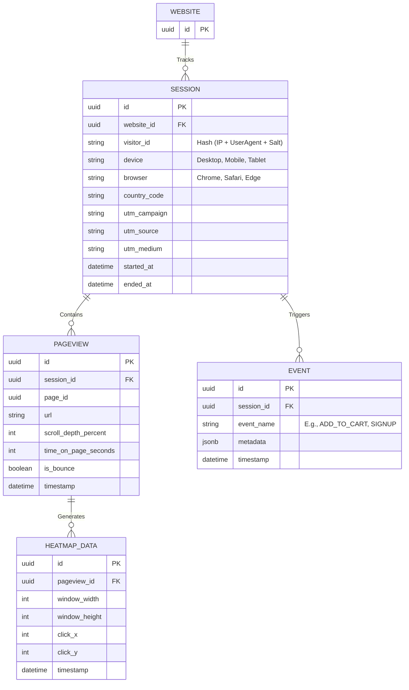

# Analytics System Specification

**Overview**: The Analytics System is a privacy-first, ultra-high-velocity telemetry engine designed to process billions of events globally. It provides users with deep insights into website traffic, conversion funnels, and visual user behavior (heatmaps) without requiring third-party scripts like Google Analytics.

---

## 1. Analytics Entity Relationship Diagram (ERD) & Database Architecture

Given the target scale of 1 Billion Pages, the Analytics database must be entirely decoupled from the core transactional Postgres database. We will utilize **ClickHouse** (an open-source column-oriented DBMS) or heavily partitioned PostgreSQL tables for OLAP workloads.

---

## 2. Core Metrics & Telemetry

**Supported Metrics**: Visitors, Sessions, Bounce Rate, Device, Browser, Country, Campaign, UTM.

### A. Dashboard & Data Aggregation
- **Visitors**: Calculated using a unique daily salt hashed against the visitor's IP and User-Agent. This ensures strict GDPR compliance without requiring invasive cookie consent banners (cookieless tracking).
- **Bounce Rate**: Calculated in ClickHouse as `(Sessions with only 1 Pageview / Total Sessions) * 100`.
- **UTM / Campaigns**: Parsed automatically by the edge tracker from the URL query strings (`?utm_campaign=xyz`) and attached to the `SESSION` entity.

### B. API
- `GET /api/v1/analytics/{websiteId}/overview?start=2026-01-01&end=2026-01-31`: Returns aggregated counts for visitors, sessions, and bounce rate.

### C. Performance & Pipeline
1. The Next.js Edge Middleware intercepts the request, appending a lightweight `<script>` payload to the HTML.
2. The tracker fires a tiny (`1x1` pixel equivalent) payload to `POST /api/collect`.
3. The API validates the payload and pushes it into an in-memory **Kafka** or **Redis Streams** queue.
4. A background consumer batches the events (e.g., 5000 at a time) and inserts them into ClickHouse/PostgreSQL, preventing the database from choking under high concurrency.

---

## 3. Conversion Funnels & Goals

**Supported Metrics**: Conversions, Funnels, Goals, Events.

### A. Dashboard
- **Funnels**: Users visually map sequences in the Dashboard (e.g., `Viewed Pricing Page -> Clicked Sign Up -> Completed Registration`). The dashboard queries ClickHouse to display the exact drop-off rate between each step.
- **Goals**: Custom monetary or semantic values assigned to specific `EVENT` triggers (e.g., "Purchased Pro Plan" = $50 Goal Value).

### B. API
- `POST /api/v1/analytics/{websiteId}/query-funnel`: Executes a complex window-function query across the `EVENT` and `PAGEVIEW` tables to calculate step-by-step conversion rates.

### C. Performance
- Calculating funnels dynamically across millions of events is extremely expensive. ClickHouse handles these OLAP queries in milliseconds using vectorized query execution, vastly outperforming standard PostgreSQL B-Trees.

---

## 4. Visual Analytics (Heatmaps & Click Maps)

**Supported Metrics**: Heatmap, Scroll Depth, Click Map.

### A. Dashboard
- **Heatmap / Click Map**: Renders an iframe of the user's live website. An HTML canvas is overlaid, fetching the aggregated `HEATMAP_DATA` (X/Y coordinates mapped against viewport sizes) and drawing a color-coded heatmap over the exact buttons and dead zones users are clicking.
- **Scroll Depth**: A horizontal line drawn across the iframe indicating where 50%, 75%, and 90% of users drop off.

### B. API & Tracking
- The tracker listens to `mousemove` (throttled), `click`, and `scroll` events.
- To save bandwidth, it buffers these interactions in the browser's memory and flushes them to `POST /api/collect` using `navigator.sendBeacon()` only when the user navigates away or closes the tab.

### C. Performance
- Storing millions of X/Y coordinates per day is the most storage-intensive operation. `HEATMAP_DATA` is explicitly TTL-limited (Time To Live) to 30 days. Older raw data is aggregated and purged automatically.

---

## 5. Realtime Reporting & Data Export

**Supported Features**: Realtime Dashboard, Export.

### A. Dashboard
- **Realtime Dashboard**: Shows active users currently on the site, their active URL, and their geographic location via a live pulsing world map.
- **Export**: Users can download raw CSV files of their event streams for integration into Tableau or internal BI tools.

### B. API
- `GET /api/v1/analytics/{websiteId}/realtime`: Powers the frontend via Server-Sent Events (SSE) or WebSockets.
- `GET /api/v1/analytics/{websiteId}/export`: Triggers a background worker to query the database, stream the massive payload directly to an S3 ZIP file, and email the user a Signed URL.

### C. Performance (Realtime)
- Realtime analytics bypass the main database entirely. Active sessions are tracked in a fast Redis cluster using probabilistic data structures (HyperLogLog) to estimate active users per minute accurately without memory bloat.
