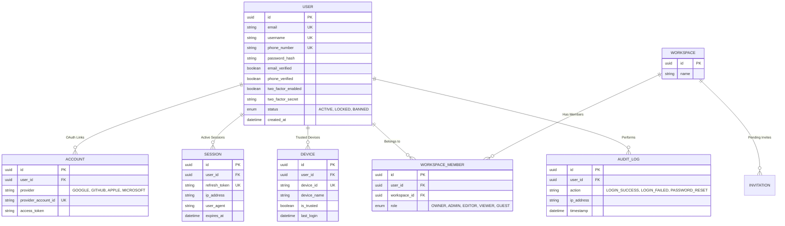
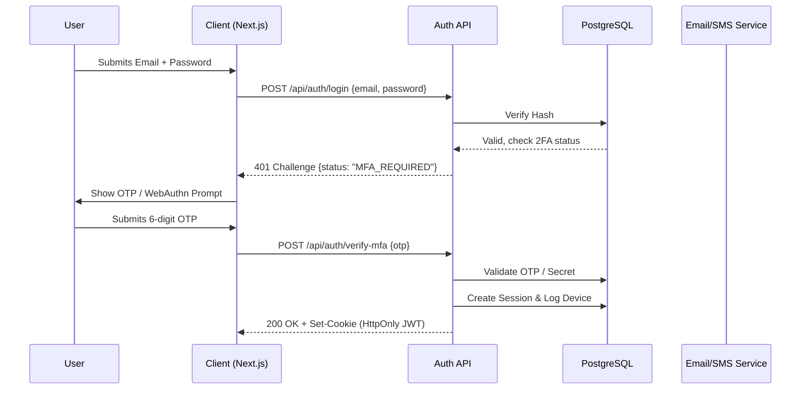
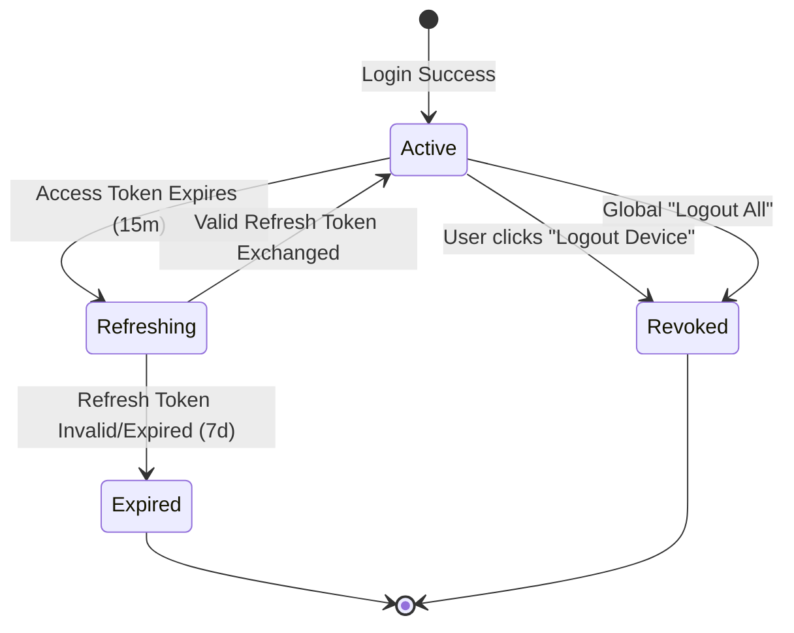
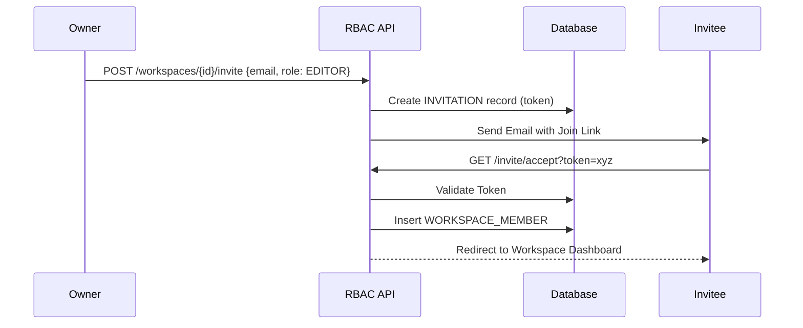

# Authentication and Identity System Specification

**Overview**: This document specifies the complete, enterprise-grade Identity and Access Management (IAM) system for the Website Builder SaaS. It is built to support modern WebAuthn, OAuth, strict RBAC, and multi-tenant workspaces, fulfilling SOC2 compliance requirements.

---

## 1. Global Entity Relationship Diagram (ERD) & Database Tables
The foundation of the IAM relies on these core database tables.

---

## 2. Authentication Methods & Workflow
**Supported Methods**: Email/Password, Username, Phone, Google, GitHub, Apple, Microsoft, Magic Link, Passkey (WebAuthn).

### A. Sequence Diagram: Multi-Factor Authentication (MFA) Flow

### B. APIs
- `POST /api/auth/login`: Handles standard credentials. Returns `{ status: "SUCCESS" | "MFA_REQUIRED" }`.
- `POST /api/auth/oauth/[provider]`: Initiates redirect to IdP.
- `POST /api/auth/webauthn/verify`: Validates FIDO2 passkey cryptographic signatures.
- `POST /api/auth/magic-link`: Generates a secure, short-lived (15 min) JWT sent via Email.

### C. Edge Cases & Security
- **Edge Case**: User signs up with Google, then tries to log in with Email.
  - *Mitigation*: Account Linking. If the email matches, prompt the user to link accounts by logging in with Google first, then setting a password.
- **Security**: Passwords hashed using `Argon2id` (exceeds bcrypt).

---

## 3. Session & Device Management
**Supported**: Remember Device/Browser, Trusted Device, Login History, Logout All Devices.

### A. State Machine: Session Lifecycle

### B. Tokens & Cookies
- **Access Token (JWT)**: Short-lived (15 minutes). Contains user claims and roles.
- **Refresh Token (Opaque)**: Long-lived (7 days). Stored in PostgreSQL `SESSION` table.
- **Cookie Security**: Both tokens are sent to the client as `HttpOnly`, `Secure`, `SameSite=Lax` cookies to prevent XSS exfiltration.

### C. Device Management API
- `GET /api/auth/sessions`: Returns Login History and active devices (IP, Browser).
- `DELETE /api/auth/sessions/[id]`: Invalidates a specific refresh token (Logout remote device).

---

## 4. Threat Mitigation & Security
**Supported**: Captcha, Rate Limiting, Brute Force Protection, IP Blocking, Geo Restriction, CSRF, XSS, Account Lock, Suspicious Login Detection.

### A. Workflow: Suspicious Login Detection
1. **Trigger**: User logs in from an IP address in a new country, or using a highly unusual User-Agent.
2. **Action**: The API flags the login attempt.
3. **State Change**: `USER.status` temporarily set to `LOCKED_PENDING_VERIFICATION`.
4. **Notification**: System emails the user: "New login attempt from [Location]. Was this you?"
5. **Resolution**: User clicks the email link to authorize the device.

### B. Rate Limiting & Brute Force
- Powered by Redis. 
- **Endpoint Limit**: `/api/auth/login` allows 5 failed attempts per IP per 15 minutes.
- **Account Lock**: 10 failed attempts on a specific username globally locks the account for 30 minutes to prevent distributed brute force.

### C. CSRF & XSS Protection
- **XSS**: Mitigated by never storing tokens in `localStorage`. Using `HttpOnly` cookies.
- **CSRF**: Mitigated via `SameSite=Lax` cookies, and explicitly checking the `Origin` and `Referer` headers on all state-mutating requests. Next.js Server Actions automatically handle Anti-CSRF tokens.

---

## 5. Multi-Tenant Role-Based Access Control (RBAC)
**Supported**: Organization, Workspace, Team, Invitation, Roles (Owner, Admin, Editor, Viewer, Guest), Permission-Based Access.

### A. Workflow & Permissions Matrix
The IAM utilizes a matrix to resolve permissions at the edge before data is fetched.

| Role | Manage Workspace | Billing | Invite Members | Edit Canvas | View Published |
| :--- | :--- | :--- | :--- | :--- | :--- |
| **Owner** | ✅ | ✅ | ✅ | ✅ | ✅ |
| **Admin** | ❌ | ✅ | ✅ | ✅ | ✅ |
| **Editor**| ❌ | ❌ | ❌ | ✅ | ✅ |
| **Viewer**| ❌ | ❌ | ❌ | ❌ | ✅ |
| **Guest** | ❌ | ❌ | ❌ | ❌ | ✅ (Restricted) |

### B. Sequence Diagram: Invitation Flow

### C. Edge Cases
- **Edge Case**: An invited user does not have an account yet.
  - *Handling*: The join link redirects to the Signup flow, carrying the invitation token in the URL. Upon successful signup, the user is automatically added to the workspace.
- **Edge Case**: The last `OWNER` of a workspace tries to leave.
  - *Handling*: The API strictly prevents this, returning a `400 Bad Request`. Ownership must be transferred to an `ADMIN` first.
