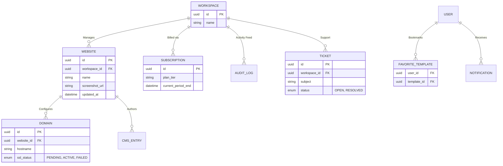

# Customer Dashboard Specification

**Overview**: The Customer Dashboard (e.g., `app.platform.com`) is the central hub for end-users. It serves as the gateway to the Website Builder, managing multi-tenant workspaces, domain routing, CMS content, and billing. It is designed to be lightning-fast, utilizing Next.js Server Components and the Axiom Design System.

---

## 1. Dashboard Global Layout & Responsive Design

### A. Dashboard Layout (Axiom Design System)
- **Global Sidebar (Left)**: Fixed width (260px). Contains the primary navigation tree (Dashboard, My Websites, Templates, Media Library, Billing, Settings). At the very top is the **Workspace Switcher** dropdown.
- **Top Bar**: Contains global Breadcrumbs, the active Workspace usage metrics (Storage/Bandwidth mini-progress bars), a bell icon for **Notifications**, and the User Avatar dropdown (**Profile**, **Support Tickets**, Logout).
- **Main Content Area**: A fluid container (`max-w-7xl`) handling the primary views. 
- **Right Slide-out Drawer**: Used for contextual, non-destructive actions (e.g., Viewing Invoice Details or quick-editing a Support Ticket) without losing context of the underlying data table.

### B. Responsive Design
- **Desktop (1024px+)**: Full Sidebar and Top Bar. Data-grids display all columns.
- **Tablet (768px - 1024px)**: Sidebar collapses into an icon-only rail (80px width). 
- **Mobile (< 768px)**: Sidebar disappears completely, replaced by a bottom tab bar (Home, Sites, Billing, Menu). Data-grids convert into stacked card layouts for touch-friendly scrolling.

---

## 2. Core User Flows & API Architecture

### A. Dashboard Home & Analytics
- **Features**: Dashboard Overview, Recent Projects, Storage Usage, Bandwidth Usage.
- **User Flow**: Upon login, the user sees a macro-view of their active Workspace. A chart displays aggregate traffic across all their published websites. Below are "Quick Jump" cards for their 3 most recently edited websites.
- **API**: `GET /api/v1/workspaces/{workspaceId}/overview`
- **Database**: Queries the `WEBSITE` table (sorted by `updated_at`), and aggregates `QUOTA` usage.

### B. Project & Asset Management
- **Features**: My Websites, Media Library, Domains.
- **User Flow**: 
  - *My Websites*: A grid of cards showing a live screenshot of each site, its status (Draft/Published), and a "Go to Builder" button.
  - *Media Library*: A centralized Masonry grid of all uploaded assets across the workspace. Users can bulk-delete or organize into folders.
  - *Domains*: Interface to attach custom domains. Provides DNS configuration instructions (CNAME/A records) and live SSL provisioning status.
- **API**: `GET /api/v1/workspaces/{workspaceId}/websites`

### C. Content & SEO Management
- **Features**: Pages, CMS, Blog, SEO.
- **User Flow**: Decoupled from the visual builder, users can write Blog posts or manage CMS data directly from the dashboard in a distraction-free Rich Text Editor. They can also perform bulk SEO updates (e.g., editing meta descriptions for 50 pages via a spreadsheet-like grid).

### D. Billing & Ecosystem
- **Features**: Subscription, Billing, Invoices, Templates, Favorite Templates.
- **User Flow**: Users can view their current plan tier, upgrade via a Stripe Checkout modal, and download PDF invoices. They can also browse the Template Marketplace and view templates they've bookmarked (`Favorite Templates`).

### E. Account & Support
- **Features**: Settings, Profile, Notifications, Support Ticket, Activity.
- **User Flow**: 
  - *Activity*: An infinite-scroll feed of the `AUDIT_LOG` (e.g., "Jane updated the homepage").
  - *Support Ticket*: A threaded messaging interface connected to Zendesk/Intercom via background APIs.

---

## 3. Entity Relationship Diagram (ERD)

This ERD isolates the entities directly managed and visualized within the Customer Dashboard.

