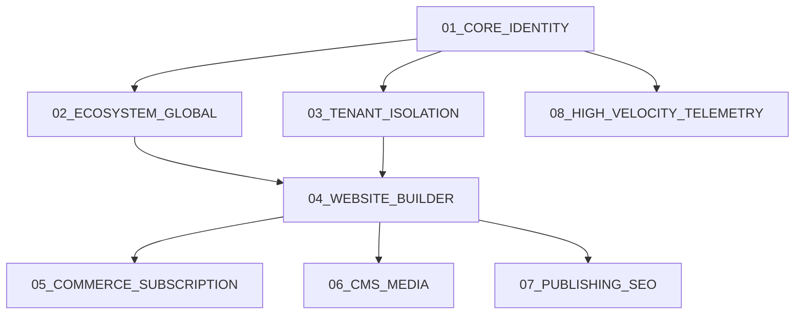

# Database Migration Plan

**Overview**: This document defines the strict, topological execution order required to safely migrate an empty PostgreSQL database up to the complete 30-table enterprise schema. It adheres to strict dependency graphs, ensuring that parent tables always exist before their child foreign keys are initialized.

---

## 1. Migration Dependency Graph

To prevent foreign key constraint violations, the database must be constructed in isolated phases.

---

## 2. Migration Execution Order

### Migration `01_CORE_IDENTITY`
- **Objective**: Establish the global authentication and administration layer.
- **Tables**: `User`, `AdminUser`, `SystemSetting`.
- **Foreign Keys**: None.
- **Indexes**: `User.email (UNIQUE)`, `AdminUser.email (UNIQUE)`, `User.deletedAt (B-Tree)`.
- **Seed Data**: Initialize the first `SUPER_ADMIN` account; insert default `SystemSetting` rows (e.g., `maintenance_mode = false`).

### Migration `02_ECOSYSTEM_GLOBAL`
- **Objective**: Create platform-wide assets accessible to all tenants.
- **Tables**: `Template`, `GlobalTheme`, `Category`, `Industry`.
- **Foreign Keys**: `Template.categoryId -> Category.id`.
- **Indexes**: `Template.industry (B-Tree)`, `Template.isPremium (B-Tree)`.
- **Constraints**: Template names must be unique.
- **Seed Data**: 50 Default Templates and 10 Industry definitions.

### Migration `03_TENANT_ISOLATION`
- **Objective**: Construct the Multi-Tenant Workspace boundaries.
- **Tables**: `Workspace`, `UserRole`.
- **Foreign Keys**: `UserRole.userId -> User.id (CASCADE)`, `UserRole.workspaceId -> Workspace.id (CASCADE)`.
- **Indexes**: `Workspace.deletedAt`, `UserRole(userId, workspaceId) (UNIQUE)`.
- **Constraints**: A user cannot have two distinct roles in the exact same workspace.

### Migration `04_WEBSITE_BUILDER`
- **Objective**: Core builder entities tied to specific Workspaces.
- **Tables**: `Website`, `Theme`, `Page`, `PageVersion`.
- **Foreign Keys**: `Website.workspaceId -> Workspace.id (CASCADE)`, `Page.websiteId -> Website.id (CASCADE)`, `PageVersion.pageId -> Page.id (CASCADE)`.
- **Indexes**: `Website.domain (UNIQUE)`, `Page(websiteId, slug) (UNIQUE)`.
- **Best Practices**: Implement raw SQL GIN Indices on `PageVersion.nodeTree` to allow for rapid querying of specific JSON schema blocks.

### Migration `05_COMMERCE_SUBSCRIPTION`
- **Objective**: Financials and quota enforcements.
- **Tables**: `Subscription`, `Invoice`.
- **Foreign Keys**: `Subscription.workspaceId -> Workspace.id (CASCADE)`.
- **Indexes**: `Subscription.stripeId (UNIQUE)`, `Subscription.status (B-Tree)`.
- **Constraints**: Only one active subscription per workspace.

### Migration `06_CMS_MEDIA`
- **Objective**: Headless data and raw assets.
- **Tables**: `CmsModel`, `CmsEntry`, `Asset`, `Folder`, `AssetTag`.
- **Foreign Keys**: `CmsModel.websiteId -> Website.id`, `CmsEntry.modelId -> CmsModel.id`, `Asset.workspaceId -> Workspace.id`.
- **Indexes**: `CmsModel(websiteId, name) (UNIQUE)`, `Asset.s3Key (UNIQUE)`.
- **Best Practices**: `Asset.fileHash` must be indexed to support rapid SHA-256 duplicate detection.

### Migration `07_PUBLISHING_SEO`
- **Objective**: Edge routing and metadata.
- **Tables**: `Domain`, `Redirect`, `DeploymentLog`.
- **Foreign Keys**: `Domain.websiteId -> Website.id`, `DeploymentLog.websiteId -> Website.id`.
- **Indexes**: `Domain.hostname (UNIQUE)`.
- **Constraints**: HTTPS must be strictly enforced via constraints where possible.

### Migration `08_HIGH_VELOCITY_TELEMETRY`
- **Objective**: Heavily partitioned tables for analytics and auditing.
- **Tables**: `AuditLog`, `PageAnalytics`, `Notification`, `EventQueue`.
- **Foreign Keys**: `AuditLog.workspaceId -> Workspace.id`.
- **Indexes**: `PageAnalytics(pageId, date) (UNIQUE)`, `EventQueue.status WHERE status = 'PENDING' (PARTIAL INDEX)`.
- **Best Practices**: Implement PostgreSQL Range Partitioning on `PageAnalytics` by Month to ensure insert velocity doesn't degrade at the 1-Billion row scale.

---

## 3. Rollback & Disaster Strategy

### A. Rollback Strategy (Migration Failures)
If `npx prisma migrate deploy` fails mid-execution (e.g., during Phase 5):
1. **Implicit Transactions**: Prisma wraps each migration in a single transaction. If a statement fails, PostgreSQL automatically rolls back the entire specific migration file.
2. **Resolution**: The DevOps team identifies the syntax error, fixes it, and re-runs `prisma migrate deploy`. Prisma's `_prisma_migrations` tracking table guarantees that completed phases (1-4) are never executed twice.

### B. Best Practices for Production Data Mutation
Once the MVP is launched and real users exist, we strictly adhere to the **Expand and Contract Pattern**:
- **Never drop or rename a column directly.** 
- **Expand**: Add the new column (e.g., `new_email`). Deploy the application logic to write to both columns.
- **Migrate**: Run a background worker to copy old data to the new column.
- **Contract**: Remove the old column in a future, safe migration.
