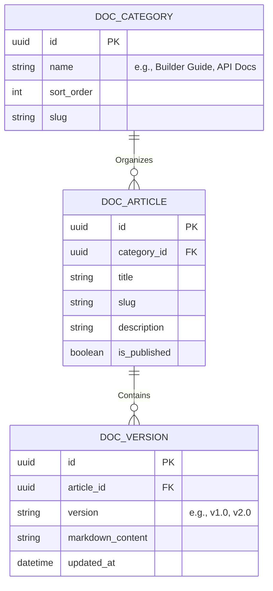

# Documentation Website Specification

**Overview**: The Documentation Website (`docs.platform.com`) is the public-facing knowledge base for the SaaS. It is an independent Next.js application optimized for extreme readability, lightning-fast full-text search, and developer-friendly API references. It is powered entirely by the Super Admin's Internal CMS.

---

## 1. Documentation Entity Relationship Diagram (ERD) & Database

The Documentation site relies on the platform's internal `CMS_ENTRY` table (managed via the Super Admin Panel). We define specific Headless CMS schemas to support complex Markdown/MDX content.

---

## 2. Content & Navigation Architecture

**Supported Categories**: Getting Started, Tutorial, FAQ, Components, Builder Guide, CMS Guide, Billing Guide, API Documentation.

### A. Navigation & Taxonomy
- **Left Sidebar**: A deeply nested, accordion-style navigation tree powered by the `DOC_CATEGORY` table.
- **Right Sidebar (Table of Contents)**: Automatically generated by parsing the `H2` and `H3` tags inside the active article's Markdown content. Sticky-scrolls with the user.
- **Top Bar**: Contains global Breadcrumbs (e.g., `Docs > Builder Guide > Layouts`), a prominent Search bar, and a **Versioning** dropdown to switch between API versions (e.g., `v1` vs `v2`).

### B. Content Enrichment (MDX)
- **Code Snippets**: Rendered using `Shiki` or `Prism.js` for syntax highlighting. Includes a "Copy to Clipboard" button and multi-language tabs (e.g., `cURL` | `Node.js` | `Python`).
- **Videos**: Supports embedding Loom or YouTube tutorials directly via custom MDX components (e.g., `<VideoEmbed id="xyz" />`).

---

## 3. Search Architecture

The ability to find answers instantly is the most critical feature of a documentation site.

### A. The Engine
- We utilize **Algolia** (or self-hosted Meilisearch) for sub-50ms full-text search capabilities, bypassing slow PostgreSQL `LIKE` queries.

### B. The Workflow
1. **Indexing**: Whenever a Super Admin updates an article in the CMS, a webhook fires. A background worker strips the Markdown syntax and pushes the clean text to the Algolia index, chunked by `H2` headers.
2. **Client Search**: The user presses `CMD+K`. A modal opens.
3. **Query**: As they type, Algolia returns instant matches. Because the index is chunked by headers, the search result doesn't just point to the page, it anchors directly to the exact paragraph (e.g., `/docs/billing#how-to-cancel`).

---

## 4. Rendering Strategy & APIs

### A. Next.js App Router (SSG)
To guarantee high Lighthouse scores and instant loads, the documentation site is 100% statically generated (SSG).

- `generateStaticParams()`: At build time, Next.js queries `GET /api/v1/admin/cms/docs` and generates a static HTML page for every single article in the database.
- **MDX Compilation**: The raw Markdown fetched from the database is compiled into React components on the server using `next-mdx-remote`.
- **Incremental Static Regeneration (ISR)**: When a Super Admin fixes a typo, they click Publish. A targeted webhook hits `revalidateTag(article_slug)`. The CDN instantly regenerates just that single HTML page in the background, keeping the site globally cached and blazing fast.

### B. APIs (Internal)
- `GET /api/v1/docs/categories`: Fetches the navigation tree for the sidebar.
- `GET /api/v1/docs/articles/{slug}?version=v1`: Fetches the raw Markdown content for MDX compilation.
