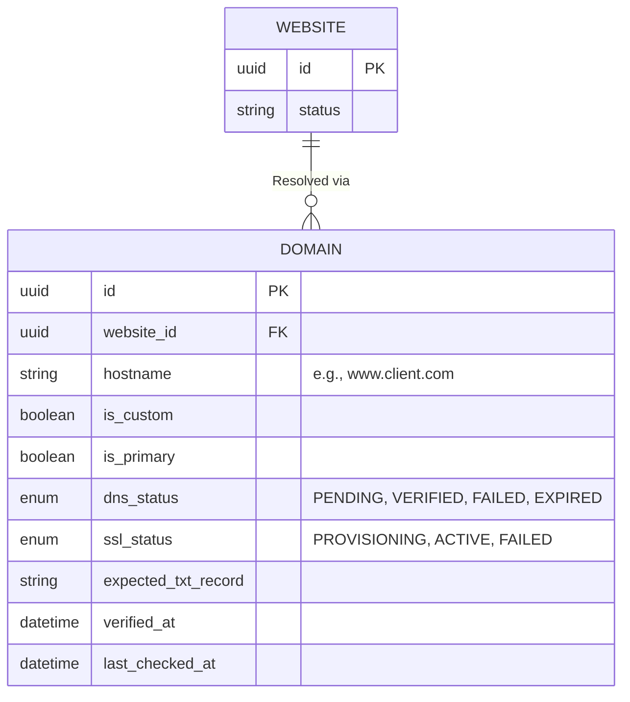

# Domain Management Specification

**Overview**: This document details the infrastructure and workflows required to provision, verify, and route domains. It ensures that every website on the platform is instantly accessible via a free platform subdomain, and provides a bulletproof system for attaching and securing external Custom Domains.

---

## 1. Domain Entity Relationship Diagram (ERD) & Database

The `DOMAIN` table acts as the source of truth for the Edge Routing Middleware.

---

## 2. Core Features & Workflows

**Supported Actions**: Platform Subdomain, Custom Domain, DNS Verification, SSL, WWW Redirect, HTTPS Redirect, Expired Domain, Reconnect, Disconnect.

### A. Workflow: Custom Domain & DNS Verification
1. **User Action**: The user enters `client.com` in the Customer Dashboard.
2. **Database Initiation**: A `DOMAIN` record is created with `dns_status = PENDING`. The system generates a cryptographic string `expected_txt_record` (e.g., `platform-verify=abc123xyz`).
3. **Dashboard Instructions**: The UI displays instructions: "Please add a TXT record to your DNS provider: `platform-verify=abc123xyz` and an A Record pointing to `76.76.21.21`."
4. **Verification Polling**: A background CRON worker polls public DNS servers (e.g., Google `8.8.8.8` or Cloudflare `1.1.1.1`) every 5 minutes using Node's `dns.resolveTxt()`.
5. **Success**: Once the TXT record propagates and matches, `dns_status` flips to `VERIFIED`.

### B. Workflow: SSL Provisioning & Edge Redirection
1. **SSL Provisioning**: Immediately upon `VERIFIED` status, the platform triggers an API call to Let's Encrypt (or Vercel Custom Domains API) to issue a TLS certificate. `ssl_status` becomes `ACTIVE`.
2. **HTTPS Redirect**: The Edge CDN is hardcoded with Strict Transport Security (HSTS). Any `http://` request to a verified domain is automatically redirected to `https://` via a `308 Permanent Redirect` at the Edge, never hitting our Node servers.
3. **WWW Redirect**: If a user sets `client.com` as their `is_primary` domain, but a visitor goes to `www.client.com`, the Edge Middleware intercepts it and returns a `308` redirect to the apex domain (or vice versa, depending on user preference).

### C. Domain Lifecycle (Disconnect, Expired, Reconnect)
- **Disconnect**: User clicks "Remove Domain" in the UI. The API triggers a `DELETE` on the `DOMAIN` record and immediately issues an API call to the CDN provider to flush the routing map and revoke the SSL certificate.
- **Expired Domain**: If a user fails to renew their domain at their external registrar, the periodic DNS verification worker will eventually fail its health check. `dns_status` falls to `EXPIRED`. The Edge Router intercepts requests and displays a "This domain is not configured correctly" error page.
- **Reconnect**: Users can click "Verify Again" in the Dashboard to force the background worker to execute a manual DNS check, bringing the status back to `ACTIVE` once they fix their external registrar issues.

---

## 3. Dashboard UI & API

### A. Dashboard Layout
- **Domain List**: A clean data-grid showing all domains attached to a specific `website_id`.
- **Status Indicators**: Prominent color-coded badges (Green = Verified, Yellow = Pending Propagation, Red = Failed/Expired).
- **Domain Detail Modal**: Displays the exact DNS records (A, CNAME, TXT) the user needs to copy/paste into GoDaddy or Route53.

### B. API Endpoints
- `POST /api/v1/websites/{id}/domains`: Attaches a new domain and returns the required TXT verification payload.
- `DELETE /api/v1/websites/{id}/domains/{domainId}`: Disconnects the domain.
- `POST /api/v1/websites/{id}/domains/{domainId}/verify`: Forces an immediate, synchronous DNS check instead of waiting for the 5-minute CRON.

---

## 4. Security Architecture
- **TXT Record Randomization**: We enforce TXT record verification rather than just CNAME verification. This prevents "Subdomain Takeover" attacks, ensuring that the person claiming the domain in our Dashboard actually owns the cryptographic root DNS zone.
- **DDoS Mitigation**: Because all domain routing is handled at the Cloudflare/Vercel Edge, malicious traffic aimed at a customer's Custom Domain is absorbed by the CDN's Web Application Firewall (WAF) before it can hit our internal infrastructure.
