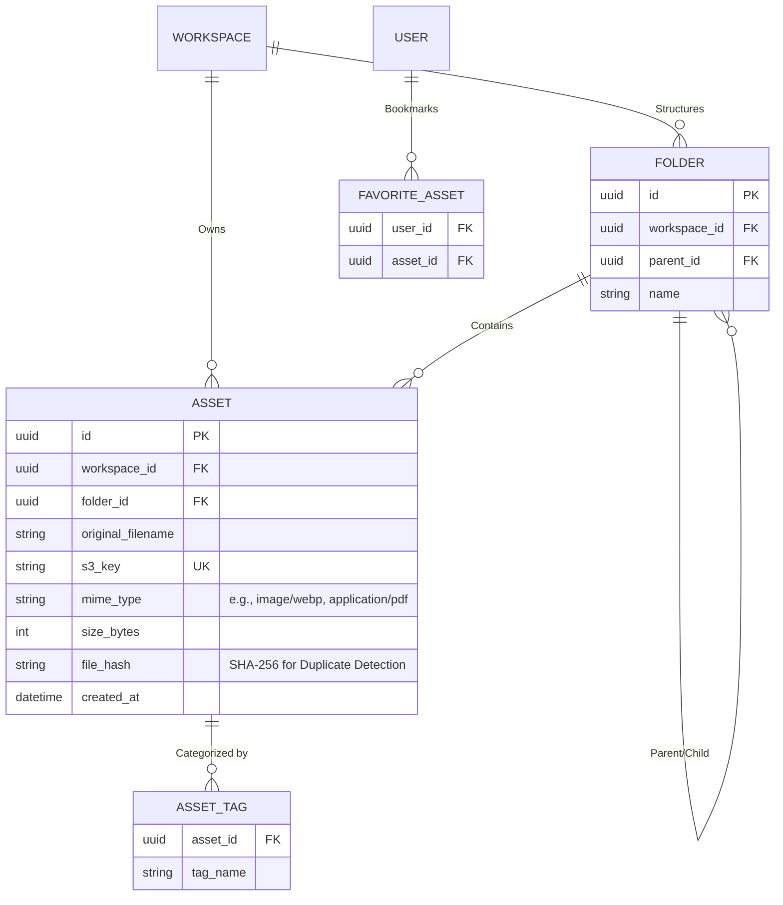

# Media Library Specification

**Overview**: The Media Library is a specialized subsystem of the overarching Storage Architecture. It provides users with a visual, high-performance UI (both within the Customer Dashboard and the Builder Engine) to upload, organize, and dynamically optimize digital assets.

---

## 1. Media Library Entity Relationship Diagram (ERD)

The Media Library introduces folders, tags, and favorite relationships on top of the base `ASSET` table.

---

## 2. Core Features & Storage Flows

**Supported Uploads**: Image, Video, Document.
**Features**: Bulk Upload, Bulk Delete, Replace File, Duplicate Detection.

### A. Storage Flow: Bulk Upload & Duplicate Detection
1. **Selection**: User drags and drops 50 images into the UI.
2. **Client-Side Hashing**: The browser calculates the `SHA-256` hash of each file locally.
3. **Duplicate Detection API**: The client sends the 50 hashes to `POST /api/v1/media/check-duplicates`.
4. **Resolution**: The server queries the `ASSET.file_hash` index. If an image already exists in the workspace, it skips the upload and simply returns the existing `ASSET` record, saving bandwidth and Storage Usage.
5. **Direct-to-S3**: For the non-duplicates, the API returns a batch of 50 S3 Presigned URLs. The client bulk-uploads directly to S3.

### B. Replace File Flow
- **Use Case**: Updating a logo without changing the URL on 500 published pages.
- **Workflow**: The user clicks "Replace" on `logo.png`. The system overwrites the physical object in S3 using the exact same `s3_key`. The CDN Cache is instantly purged for that specific URL.

---

## 3. Organization & Retrieval

**Supported Features**: Folder, Search, Filter, Tag, Favorite, Recently Uploaded.

### A. Database Query Optimization
- **Folders**: Implemented using an Adjacency List pattern (`parent_id`). The UI requests `GET /api/v1/media?folderId=xyz`.
- **Tags & Search**: The `ASSET_TAG` table allows fast N:M filtering. Full-text search operates on `original_filename` and `tag_name`.
- **Recently Uploaded**: The default masonry grid view sorts by `ORDER BY created_at DESC`.

### B. API
- `GET /api/v1/media`: The primary retrieval endpoint. Supports robust query parameters: `?mimeType=image/*&folderId=123&sort=-createdAt&isFavorite=true`.

---

## 4. Media Optimization Strategy

**Supported Features**: Image Compression, WebP, AVIF, Image Resize, Lazy Loading, CDN, Thumbnail, Preview, Storage Usage.

### A. Optimization Strategy (On-the-Fly Processing)
As defined in the core Storage Architecture, we explicitly avoid generating static thumbnails at upload time to prevent massive S3 storage bloat (which inflates the user's **Storage Usage** quota).

1. **Thumbnails & Previews**: 
   - When the Media Library UI loads, it requests: `/cdn-cgi/image/width=200,quality=60/asset_id.jpg`.
   - The Edge CDN (Cloudflare/Vercel) intercepts the request, grabs the raw 5MB 4K image from S3, resizes it to a 200px thumbnail, converts it to **WebP** or **AVIF**, and caches it globally.
   - Subsequent loads of the Media Library hit the CDN cache in <20ms.

2. **Lazy Loading**: 
   - The Media Library UI utilizes React Virtualization (or standard `loading="lazy"`) to only request thumbnails for images currently visible in the browser viewport. If a user has 10,000 images, only 30 network requests are made on initial load.

3. **Image Compression & Resize (Published Sites)**:
   - When an asset is dragged onto the Builder Canvas, the rendering engine automatically parses the container's CSS width (e.g., `800px`).
   - It appends the exact resize parameters to the CDN URL, ensuring the end-user's browser never downloads a byte more than necessary, guaranteeing 100/100 Lighthouse performance scores.
