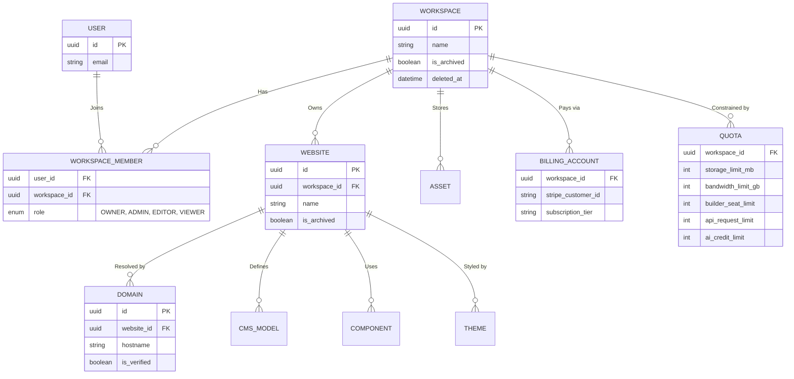

# Enterprise Multi-Tenant System Specification

**Overview**: This document defines the logical separation, data isolation, and resource provisioning architecture for the B2B SaaS platform. It ensures that a single user can manage multiple isolated organizations, and that each organization is securely firewalled from others regarding billing, assets, and limits.

---

## 1. Multi-Tenant Entity Relationship Diagram (ERD) & Relationships

The foundational architecture revolves around the `WORKSPACE` (Organization) acting as the absolute boundary for all child entities.

### Relationships Explained
- **One Account, Multiple Organizations**: A `USER` is decoupled from a `WORKSPACE`. A User connects to a Workspace via the `WORKSPACE_MEMBER` pivot table. This allows one user to seamlessly switch contexts (via an **Organization Switcher** UI) without logging out.
- **Strict Isolation**: `WEBSITE`, `ASSET` (Storage), `CMS`, `THEME`, and `COMPONENT` all hold foreign keys mapping to `WORKSPACE_ID` (or `WEBSITE_ID` which transitively maps to `WORKSPACE_ID`). Data cannot leak across Workspaces because every database query inherently requires `WHERE workspace_id = ?`.
- **Separate Billing & Templates**: The `BILLING_ACCOUNT` is tied directly to the Workspace, not the User. This allows agencies to pass billing directly to their clients (separate Workspaces).

---

## 2. Resource Management & Quotas
- **Quota Table**: Every workspace has a corresponding row in the `QUOTA` table tracking limits.
- **Storage Limit**: Enforced during S3 presigned-URL generation. If `current_storage_mb + new_file_mb > storage_limit_mb`, the API rejects the upload.
- **Bandwidth Limit**: Tracked via Edge CDN logs aggregated daily into PostgreSQL.
- **Builder Limit**: Number of concurrent editor sessions allowed, enforced via WebSockets/Redis presence channels.
- **API Limit**: API rate limiting tracked via Redis token buckets tied to the `WORKSPACE_ID`.
- **AI Credit**: Deducted transactionally when a user prompts the generative UI engine.

---

## 3. Data Lifecycle (Soft Delete, Archive, Restore)
- **Soft Delete**: When a user "deletes" a Website or Workspace, the system sets `deleted_at = NOW()`. The record remains in the database for 30 days. All read queries automatically append `WHERE deleted_at IS NULL`.
- **Archive**: Users can explicitly set `is_archived = true` for old projects. Archived websites are removed from the CDN and Builder UI but do not have a 30-day destruction countdown.
- **Restore**: Users can undo soft deletions within the 30-day window, setting `deleted_at = null`, instantly restoring CDN routes and data access.

---

## 4. Permission Flow
1. **Request Initiation**: User attempts an action (e.g., `POST /api/websites/123/publish`).
2. **Context Resolution**: The API extracts the `WebsiteID`, queries the DB to find its parent `WorkspaceID`.
3. **Role Check**: The API checks the `WORKSPACE_MEMBER` table for the User's role in that specific `WorkspaceID`.
4. **Authorization**: If the role is `VIEWER`, the publish action is rejected (`403 Forbidden`). If `ADMIN` or `OWNER`, the action proceeds.

---

## 5. Security Architecture (Tenant Isolation)
- **Logical Isolation**: We rely on shared PostgreSQL tables (Logical Isolation), meaning all tenants share the same `WEBSITES` table.
- **Row Level Security (RLS)**: To prevent accidental cross-tenant data leaks due to developer error (e.g., forgetting a `WHERE` clause), PostgreSQL RLS policies will be enforced on all tables. E.g., `CREATE POLICY workspace_isolation ON websites FOR ALL USING (workspace_id = current_setting('app.current_workspace_id'));`
- **Asset Security**: S3 objects are stored with prefixes: `s3://bucket/workspaces/{workspace_id}/assets/`. IAM policies ensure users can only generate read/write tokens for their specific prefix.

---

## 6. Scalability & Performance
- **Scalability**: By using a single global `USERS` table and isolated `WORKSPACE` foreign keys, the database remains highly normalized. If a single Workspace grows too large (e.g., an enterprise client), we can implement Database Sharding keyed by `workspace_id`, migrating their specific data to a dedicated Postgres instance without changing the application logic.
- **Performance**: Organization switching is instantaneous because the frontend JWT contains an array of accessible `workspace_ids`. No extra DB lookups are required to populate the Organization Switcher dropdown.

---

## 7. Migration Strategy
If a user upgrades from a single-tenant legacy system or if we need to migrate data across shards:
1. **Downtime Minimization**: The migration script copies all records matching `WHERE workspace_id = X` to the new database shard using PostgreSQL Logical Replication.
2. **Cutover**: The router updates the `workspace_shard_map` in Redis.
3. **Rollback**: Because logical replication can run bi-directionally, we can instantly rollback traffic to the original database if the new shard fails.
