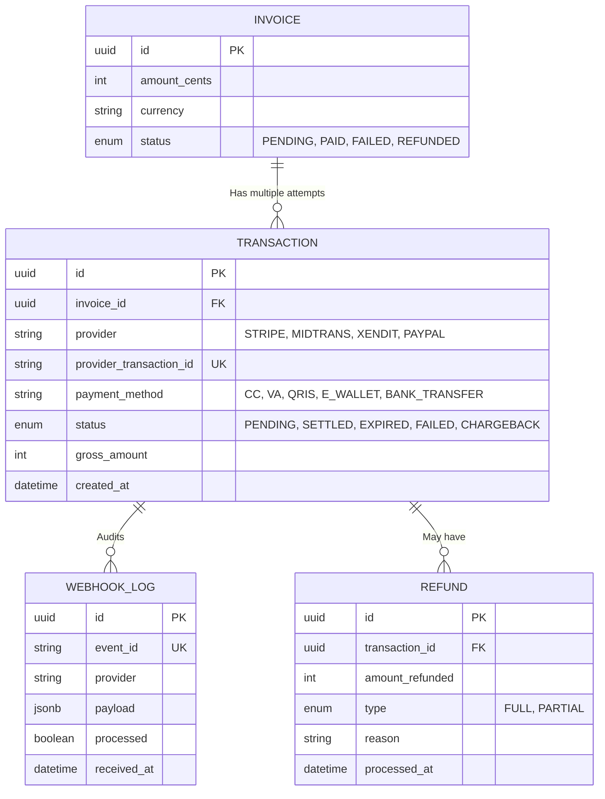
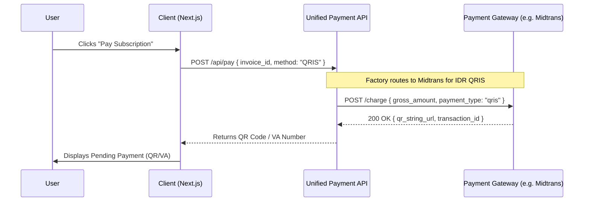

# Payment Gateway Integration Specification

**Overview**: This document outlines the unified Payment Gateway Architecture, designed to aggregate international (Stripe, PayPal, Apple/Google Pay) and Southeast Asian regional gateways (Midtrans, Xendit). It abstracts the complexities of multiple payment methods into a single internal API layer while maintaining strict PCI DSS compliance.

---

## 1. Unified Payment Entity Relationship Diagram (ERD)

To abstract multiple providers, we use a unified `TRANSACTION` ledger that normalizes data from Midtrans, Xendit, Stripe, and PayPal.



---

## 2. Multi-Provider Flowchart & Sequence Diagram

The system uses a **Payment Gateway Factory** pattern. Based on the User's currency or region (e.g., IDR vs USD), the internal API routes the charge to the optimal gateway.

### A. Checkout Sequence (E-Wallets, QRIS, VA, CC)


---

## 3. Webhook Flow & Idempotency

Webhooks are the absolute source of truth for payment status. We do not rely on the client browser confirming a payment.

### A. Webhook Flowchart
```mermaid
graph TD
    A[Gateway Fires Webhook] --> B[Edge API /api/webhooks/{provider}]
    B --> C{Signature Valid?}
    C -->|No| D[Reject 401 Unauthorized]
    C -->|Yes| E{Event ID Processed?}
    E -->|Yes| F[Ignore 200 OK - Prevent Double Process]
    E -->|No| G[Log to WEBHOOK_LOG]
    G --> H[Update TRANSACTION status]
    H --> I[Update INVOICE status]
    I --> J[Trigger Post-Payment Actions]
```

### B. Webhook Reliability Constraints
- **Signature Validation**: Every provider uses a different signing secret (Stripe `Stripe-Signature`, Midtrans `X-Append-Notification`). The API extracts the raw request body, hashes it locally using the secret, and compares it to the header to prevent spoofing.
- **Webhook Retry**: If our API is down, gateways will retry exponentially for up to 72 hours. Our endpoints must return a `200 OK` rapidly to acknowledge receipt.
- **Idempotency**: The `WEBHOOK_LOG` checks the unique `event_id` provided by the gateway. If a retry arrives for an already processed event, it is ignored safely.

---

## 4. Payment Lifecycle & Edge Cases

- **Pending Payment**: Default state for asynchronous methods (Virtual Account, QRIS, Bank Transfer). The user has instructions to pay within a time limit.
- **Expired Payment**: If a VA/QRIS is not paid within 24 hours, a webhook fires. The system marks the transaction `EXPIRED` and the user must generate a new invoice.
- **Payment Retry**: For Credit Cards, if a charge fails (insufficient funds), the status is `FAILED`. The user is prompted to try a different card, generating a new `TRANSACTION` against the same `INVOICE`.
- **Chargeback**: A user disputes a CC charge with their bank. A webhook alerts the system. The transaction is marked `CHARGEBACK`, the user's workspace is immediately `PAUSED` (locked), and a support ticket is generated.
- **Refund / Partial Refund**: Executed via the Provider Dashboard (or our Admin API). Triggers a webhook adjusting the ledger, allowing prorated refunds without breaking accounting integrity.

---

## 5. Security & PCI DSS Considerations

To eliminate the massive regulatory burden of handling raw cardholder data (PAN, CVV), our architecture enforces strict decoupling.

1. **No Raw Card Data Storage (PCI SAQ-A Compliance)**:
   - We NEVER route raw credit card numbers through our servers.
   - For CC payments, we use **Stripe Elements**, **Midtrans Snap**, or **Xendit xenInvoice** directly on the frontend.
   - The user inputs their CC directly into a secure iframe hosted by the gateway. The gateway returns a `payment_method_id` (token) to our Next.js client, which is then sent to our API to finalize the charge.
2. **Fraud Detection**:
   - We leverage built-in gateway ML (e.g., Stripe Radar, Midtrans Aegis).
   - High-risk payments (e.g., mismatched billing zip code and IP address) are automatically blocked by the gateway before reaching our webhooks.
3. **Apple Pay / Google Pay**:
   - Utilizes the Payment Request API natively via Stripe/Midtrans integrations, completely bypassing manual data entry and relying on biometric authentication on the user's device.

---

## 6. API Interface Definitions
- `POST /api/payments/checkout`: Generates the initial payload/token required to mount the Gateway UI (e.g., returning a Stripe Client Secret or Midtrans Snap Token).
- `GET /api/payments/history`: Retrieves the `TRANSACTION` ledger for a specific workspace, joining `INVOICE` data.
- `POST /api/webhooks/midtrans`: The dedicated listener for Midtrans (handles VA settlements and QRIS scans).
- `POST /api/webhooks/stripe`: The dedicated listener for Stripe (handles global CC, Apple Pay, Google Pay).
- `GET /api/payments/{id}/receipt`: Generates a downloadable PDF receipt mapping to the specific transaction.
