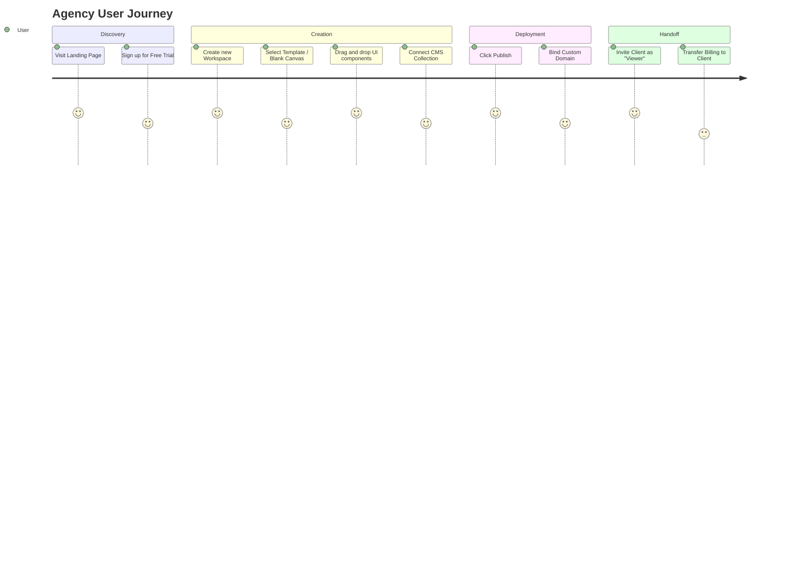

# Product Requirement Document (PRD)

**Project**: Enterprise Website Builder SaaS Platform
**Status**: Draft / Under Review
**Target Audience**: Businesses, Design Agencies, Enterprise Marketing Teams

---

## 1. Vision

To empower every business, regardless of technical capability, to create, deploy, and manage stunning, high-performance web experiences instantly without compromising on enterprise-grade scalability, security, or design freedom.

## 2. Mission

To provide a world-class visual drag-and-drop website builder that seamlessly merges the creative freedom of design tools (like Figma) with the structural robustness of modern web frameworks (Next.js/React), enabling agencies and enterprises to iterate faster and scale infinitely.

## 3. Objectives

- **Launch MVP in Q3**: Deliver the core drag-and-drop builder, CMS, and publishing engine.
- **Achieve $1M ARR in Year 1**: Through agency partnerships and tiered enterprise SaaS pricing.
- **Top-Tier Performance**: Guarantee 90+ Core Web Vitals across all published websites by default.
- **Enterprise Security Compliance**: Achieve SOC2 Type I compliance within 6 months of MVP launch.

## 4. Business Goals

- **Disrupt the mid-market and enterprise CMS space** currently dominated by WordPress and Sitecore.
- **Create an ecosystem**: Build a plugin/theme marketplace enabling third-party developers to monetize their assets, driving exponential platform growth.
- **High Retention**: Achieve a net revenue retention (NRR) rate of 120% through upselling enterprise features like multi-tenant workspaces, audit logs, and custom domain limits.

## 5. User Personas

### A. The Agency Owner (Sarah)

- **Role**: Runs a digital marketing agency with 20 employees.
- **Needs**: Needs to deliver client sites quickly. Requires white-labeling, multi-tenant client handoff, and high SEO performance.
- **Pain Point**: Current platforms are either too rigid (Wix) or require too much custom code maintenance (WordPress).

### B. The Enterprise Marketer (David)

- **Role**: CMO at a mid-size SaaS company.
- **Needs**: Needs to spin up highly converting landing pages instantly without waiting for the engineering team.
- **Pain Point**: Engineering bottleneck; lack of integration between the marketing CMS and the core product app.

### C. The Freelance Designer (Leo)

- **Role**: UI/UX Designer who builds bespoke sites.
- **Needs**: Total design freedom. Hates templates. Wants pixel-perfect control (Figma-to-Web).
- **Pain Point**: Hates writing HTML/CSS but understands flexbox and grid concepts.

## 6. Market Research

The global website builder market size was valued at USD 1.8 Billion in 2022 and is projected to reach USD 3.5 Billion by 2030, growing at a CAGR of 8.5%. The shift towards headless architecture and headless CMS presents a unique opportunity for an edge-native visual builder. Current market gaps include:

- Lack of native React/Next.js export capabilities in traditional builders.
- Poor Core Web Vitals on older platforms (e.g., Elementor).
- Insufficient enterprise collaboration features (RBAC, Audit Trails) in modern tools like Webflow.

## 7. Competitor Analysis

| Competitor                | Core Strength                      | Core Weakness                        | Our Advantage                          |
| :------------------------ | :--------------------------------- | :----------------------------------- | :------------------------------------- |
| **Webflow**               | Excellent design control, CMS      | Steep learning curve, expensive      | Modern React stack, cheaper scaling    |
| **Framer**                | Incredible animations, React-based | CMS is limited, poor enterprise RBAC | Better CMS, robust enterprise features |
| **Wix**                   | Extremely easy to use              | Code bloat, terrible performance     | Edge-native Next.js performance        |
| **WordPress/Elementor**   | Massive ecosystem                  | Security nightmares, slow            | SOC2 ready, 0 plugin maintenance       |
| **Shopify Theme Builder** | Native e-commerce                  | Hard to build non-e-commerce pages   | General purpose B2B/SaaS focus         |

## 8. SWOT Analysis

- **Strengths**: Built on modern Next.js App Router, highly performant, edge-ready, developer-friendly backend (Prisma/PostgreSQL).
- **Weaknesses**: Starting with zero marketplace assets (templates, UI kits) compared to entrenched competitors.
- **Opportunities**: AI-driven generation is nascent in Webflow/Framer; we can build AI generation natively into our MVP.
- **Threats**: Incumbents copying the Next.js visual builder approach.

## 9. Functional Requirements

- **Visual Editor**: Real-time drag-and-drop canvas supporting Flexbox, CSS Grid, absolute positioning.
- **Component System**: Reusable symbols/components with state overrides.
- **CMS**: Dynamic collections (e.g., Blogs, Testimonials) with relationship mapping.
- **Publishing**: One-click publish to Vercel/S3 with custom domain mapping and automatic SSL.
- **Workspaces**: Multi-tenant organizations with Role-Based Access Control (RBAC).
- **Billing**: Automated subscription management via Stripe/Midtrans/Xendit.

## 10. Non-Functional Requirements

- **Performance**: Editor UI must respond under 16ms (60fps drag-and-drop). Published pages must score >90 Lighthouse.
- **Scalability**: Architecture must support 10,000+ concurrent editor sessions via stateless Edge functions.
- **Security**: Data encryption at rest (AES-256) and in transit (TLS 1.3). Strict XSS prevention in the CMS.
- **Availability**: 99.99% uptime SLA for published sites.
- **I18n**: The editor interface and the generated sites must support dynamic locales and RTL layouts.

## 11. User Journey

## 12. Customer Journey

1. **Awareness**: Sees Twitter/LinkedIn ad comparing our performance scores vs Webflow.
2. **Acquisition**: Signs up using GitHub/Google OAuth (Auth.js).
3. **Activation**: Successfully publishes their first "Hello World" site to a `.ourbuilder.com` subdomain within 5 minutes.
4. **Retention**: Imports their company team members to collaborate on a larger CMS project.
5. **Revenue**: Hits the 2-project free-tier limit and upgrades to the "Agency Pro" $49/mo plan.
6. **Referral**: Uses the affiliate link to invite other agencies, getting a recurring 20% cut.

## 13. Monetization

- **SaaS Subscriptions**: Tiered monthly/annual recurring revenue based on usage limits.
- **Marketplace Commissions**: 30% take-rate on themes and components sold by community creators.
- **Enterprise Contracts**: Custom SLAs, dedicated account managers, SSO/SAML integration for flat 5-figure annual fees.

## 14. Pricing Model (Draft)

| Plan           | Price (Monthly) | Target      | Limits                       | Key Features                            |
| :------------- | :-------------- | :---------- | :--------------------------- | :-------------------------------------- |
| **Starter**    | $0              | Hobbyists   | 2 Sites, ourbuilder domain   | Core Editor, 50 CMS items               |
| **Pro**        | $24             | Freelancers | 5 Sites, Custom Domains      | Basic RBAC, 500 CMS items, No Branding  |
| **Agency**     | $89             | Agencies    | Unlimited Sites, White-label | Client billing handoff, 5,000 CMS items |
| **Enterprise** | Custom ($999+)  | Large Corps | Custom                       | SSO, Audit Logs, Dedicated Infra, SLA   |

## 15. Roadmap

- **Phase 1 (M1-M3)**: Core Editor, Basic Elements (Div, Text, Image), Auth, Vercel Deployment.
- **Phase 2 (M4-M5)**: Dynamic CMS, Collections, Rich Text Editing.
- **Phase 3 (M6)**: Custom Domains, Billing Gateway Integrations, Pro Launch.
- **Phase 4 (M7-M9)**: Enterprise RBAC, Activity Logs, Theme Marketplace Beta.

## 16. MVP Specifications

- **Stack**: Next.js App Router, Tailwind, PostgreSQL, Prisma.
- **Editor**: Absolute minimum elements: Section, Container, Grid, Typography, Image, Button.
- **CMS**: 1 CMS Model type (e.g., Blog Posts) with String and Rich Text fields.
- **Publishing**: SSG (Static Site Generation) export to Vercel/S3 with a fallback subdomain.
- **Auth/Billing**: GitHub OAuth + Stripe Checkout for Pro tier.

## 17. Enterprise Features

- **Single Sign-On (SSO)**: SAML/OIDC integrations for corporate IT compliance.
- **Granular RBAC**: Custom roles (e.g., "Can edit CMS, cannot publish", "Can edit CSS, cannot change layout").
- **Audit Logs**: Irrefutable ledger of who changed what, and when.
- **Staging Environments**: `draft.domain.com` vs `www.domain.com` with approval workflows.
- **Data Residency**: Option to host data explicitly in EU (GDPR) or US regions.

## 18. Future AI Features

- **Generative UI (Text-to-Site)**: Prompt the builder (e.g., "Generate a dark-mode SaaS pricing page") and the canvas instantly populates with fully editable node trees.
- **AI Copywriting**: Inline GPT-4 integration within the CMS for automatic blog drafting and SEO meta-tag generation.
- **Auto-A11y**: AI agent that scans the DOM tree in the editor and suggests missing ARIA labels, alt text, and color contrast fixes.
- **Layout Auto-Fix**: One-click responsive fix using AI to automatically adjust flex-wrapping and padding for mobile views.

## 19. Risks & Mitigations

- **Technical Risk (DOM Performance)**: Storing hundreds of nested React components can lag the browser.
  - _Mitigation_: Use virtualized DOM rendering and strictly optimize React reconciliation in the canvas.
- **Business Risk (High Churn)**: Users build a site, export it, and cancel.
  - _Mitigation_: Heavily integrate the CMS, forms, and analytics so the platform acts as the operational heartbeat of their site, making it sticky.
- **Security Risk (User-generated Code)**: Malicious users injecting XSS via the custom HTML block.
  - _Mitigation_: Strict iframe sandboxing and Content Security Policies (CSP).

## 20. Success Metrics (KPIs)

- **Time to First Publish (TTFP)**: Target < 10 minutes from signup to live URL.
- **Monthly Active Users (MAU)**: Target 10,000 MAU by Month 6.
- **Customer Acquisition Cost (CAC) to LTV**: Target an LTV:CAC ratio of > 3:1.
- **Site Performance**: 95% of published websites scoring >90 on Google PageSpeed Insights.
- **System Uptime**: 99.99% measured monthly.
