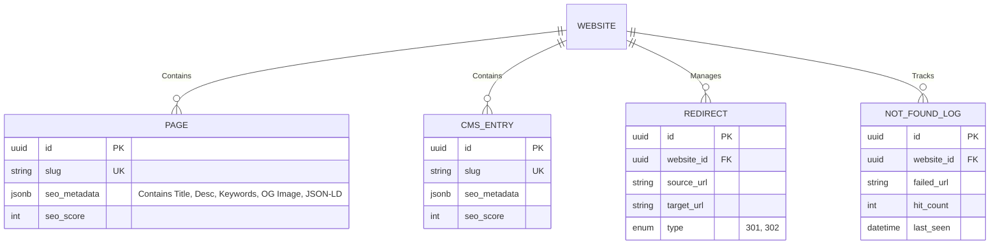

# SEO Management Specification

**Overview**: The SEO Management subsystem provides the Customer Dashboard interface and backend APIs required for end-users to exert granular control over their website's search engine presence. It acts as the UI layer mapping user inputs to the automated edge-rendering pipelines defined in the SEO Engine.

---

## 1. SEO Entity Relationship Diagram (ERD) & Database

SEO metadata is tightly coupled to `PAGE` (static routes) and `CMS_ENTRY` (dynamic routes). We store the exact overrides in a highly flexible `seo_metadata` JSONB column to prevent massive table schema bloat. Redirects and 404 logs have their own dedicated tables.

---

## 2. Core Dashboard Features & APIs

**Supported Dashboard Features**: Meta Title, Meta Description, Keywords, Open Graph, Twitter Card, Canonical URL, Slug.

### A. Dashboard Layout & Flow (Page-Level SEO)
- **UI Element**: A dedicated "SEO Settings" drawer accessible from both the Builder Engine and the Customer Dashboard (Pages List).
- **Inputs**: 
  - Text fields for `Meta Title`, `Meta Description`, `Keywords` (comma separated tags).
  - Image upload block for `Open Graph` & `Twitter Card` images (auto-resizes to 1200x630).
  - Toggle switch for `Canonical URL` (defaults to auto-generating from the primary domain).
- **API**: `PATCH /api/v1/websites/{id}/pages/{pageId}/seo`. Accepts a validated JSON payload and updates the `PAGE.seo_metadata` column.

### B. Dashboard Layout & Flow (Redirects & 404s)
- **UI Element**: The "Routing & Redirects" panel in the Dashboard.
- **Redirects**: A data-grid where users can manually enter `source_url` and `target_url` pairs, selecting `301 Permanent` or `302 Temporary`.
- **404 Tracker**: A list populated by the `NOT_FOUND_LOG` table. If a user sees `hit_count = 500` for `/old-pricing`, they can click a "Map Redirect" button to instantly create a 301 rule, capturing lost traffic.
- **API**: `POST /api/v1/websites/{id}/redirects`

---

## 3. Automated Optimizations & Machine Files

**Supported**: Robots.txt, Sitemap.xml, Schema.org, JSON-LD, Breadcrumb, Image SEO (Alt Text).

### A. Optimization Flow (Robots & Sitemaps)
- Users do not manually write XML files.
- `Robots.txt`: Controlled via a simple UI toggle ("Hide this site from search engines"). If toggled, the API generates a `User-agent: * Disallow: /` output. Otherwise, it points to the Sitemap.
- `Sitemap.xml`: Fully automated. The Edge CDN compiles it on the fly by combining all `PAGE.slug` and `CMS_ENTRY.slug` values that do NOT have the `noindex` flag set in their `seo_metadata`.

### B. Optimization Flow (Schema.org & Breadcrumbs)
- `JSON-LD`: The dashboard allows advanced users to paste custom JSON-LD scripts into a "Custom Schema" box. However, for 90% of users, the system auto-generates `Article`, `Product`, or `LocalBusiness` schemas based on the selected Template category.
- `Breadcrumb`: The Next.js App Router automatically calculates path hierarchy (e.g., `/products/shoes`) and injects standard Breadcrumb JSON-LD.

### C. Optimization Flow (Image SEO)
- **Dashboard**: The Media Library exposes a bulk-editor data-grid for `Alt Text`. Users can scroll through 100 images and type alt tags like a spreadsheet. If an image is missing alt text, it is flagged with a red warning icon.

---

## 4. Analytics Integration & Scoring

**Supported**: SEO Score.

### A. Optimization Flow (SEO Score Generation)
- **The Engine**: When a user saves a Page or Blog post, an internal algorithm (similar to Yoast SEO) calculates an `seo_score` (0-100).
- **The Checks**: 
  - Is the `Meta Title` between 50-60 characters?
  - Does the `Meta Description` exist and is it < 160 characters?
  - Is the `Slug` short and clean?
  - Do all images in the `node_tree` contain `Alt Text`?
- **Dashboard Feedback**: The score is displayed prominently as a colored circle (Red, Yellow, Green) next to the Page name in the dashboard, driving gamified optimization behavior.
