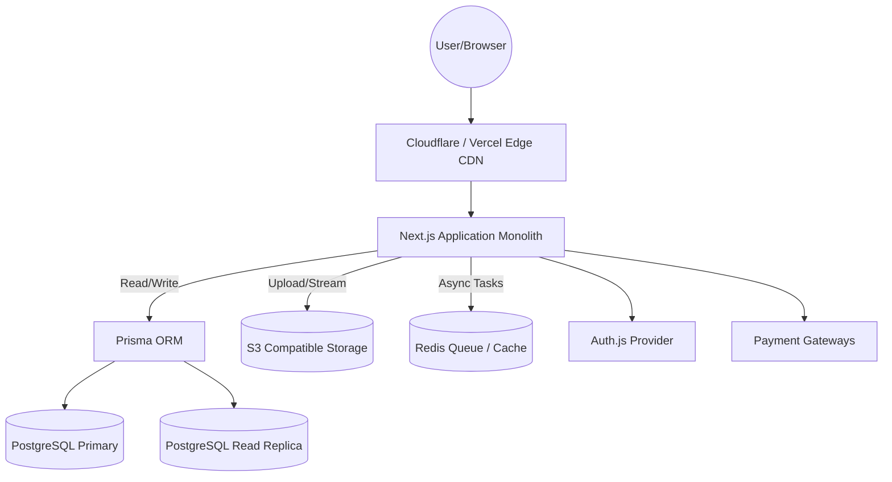
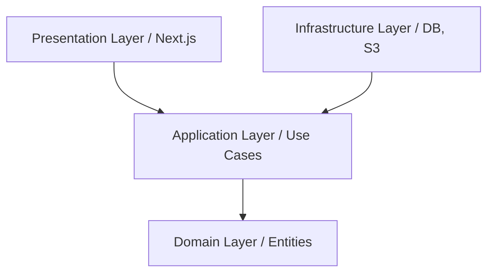
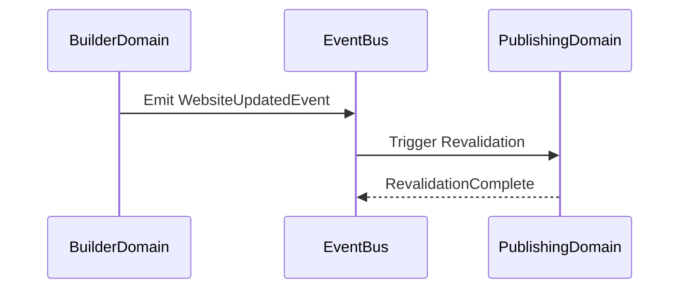
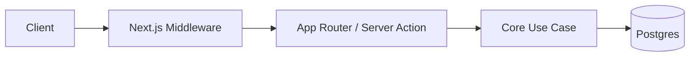
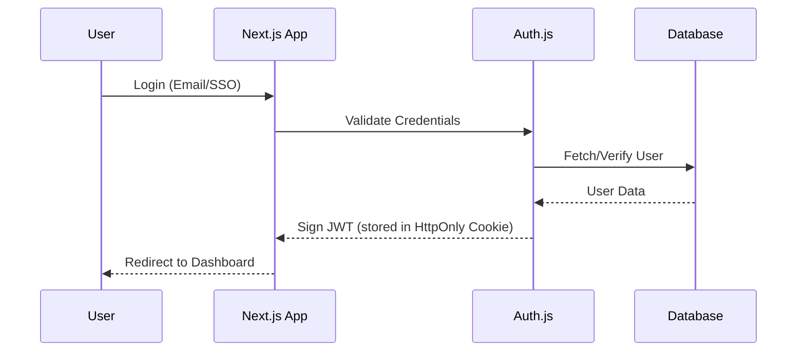
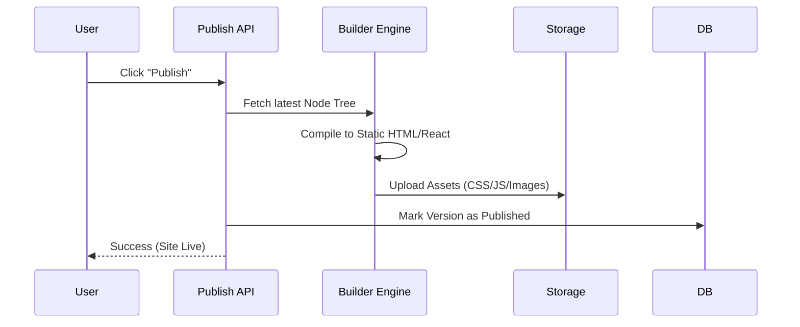
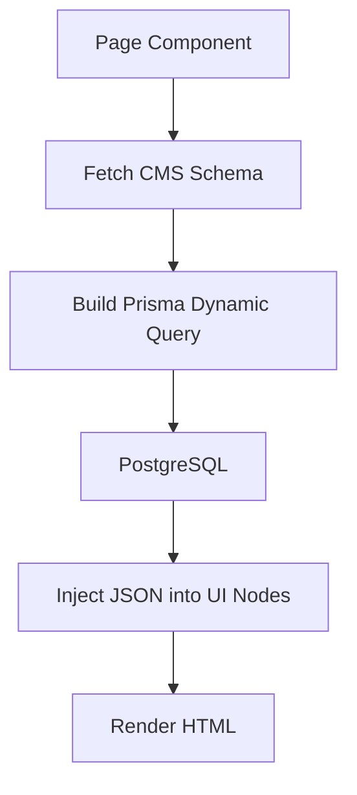
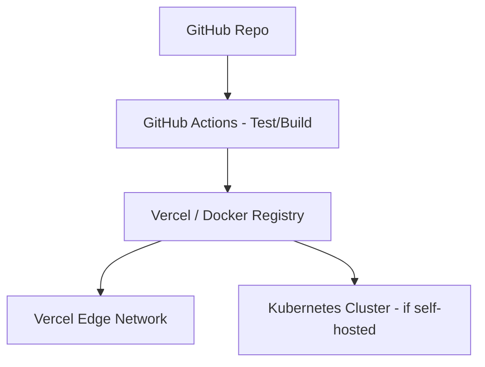

# Enterprise Website Builder SaaS: Software Architecture Document

## 1. High Level Architecture
The system is built as a cloud-native, edge-rendered multi-tenant SaaS. It utilizes Next.js App Router as the core framework, separating the highly interactive visual builder (Client Components) from the high-performance published websites (React Server Components / SSG). 


*Explanation*: All incoming requests hit an Edge CDN which serves cached published sites instantly. Dynamic requests route to the Next.js application, which interfaces with PostgreSQL via Prisma, utilizing Redis for caching and background queues.

## 2. Clean Architecture
We adhere to Clean Architecture principles by strictly separating concerns. The inner core contains business logic (Entities/Use Cases) which knows nothing about the outer layers (Next.js, Prisma, APIs).
* **Inner**: Domain Entities (Website, CMS, Page).
* **Middle**: Application Use Cases (PublishWebsite, UpdateCanvasNode).
* **Outer**: Interface Adapters (API Routes, React Components).
* **Outermost**: Frameworks & Drivers (Postgres, S3, Next.js).

## 3. DDD (Domain Driven Design)
The system is divided into Bounded Contexts to isolate complexity.
- **Identity Context**: Users, Workspaces, RBAC.
- **Builder Context**: Pages, Node Trees, Themes, Components.
- **CMS Context**: Schemas, Entries, Relations.
- **Billing Context**: Subscriptions, Invoices.
- **Publishing Context**: Domains, SSL, Static Generation.

## 4. Modular Monolith vs Microservice Analysis
- **Microservices**: High operational overhead (K8s management, network latency, distributed tracing). Overkill for MVP and Phase 1 enterprise scale.
- **Modular Monolith**: Single deployment unit, fast in-memory function calls, strict domain separation enforced via folder structure and linters.
*Analysis*: A Modular Monolith minimizes infrastructure complexity while preserving the ability to extract bounded contexts into microservices later if scaling demands it (e.g., if the Image Processing domain requires massive GPU scaling independent of the CRM domain).

## 5. Recommended Architecture
**Strict Modular Monolith deployed on Vercel/Docker**.
We will utilize Next.js as a modular monolith where domains are separated in a `src/core/` directory, preventing spaghetti code while maintaining deployment simplicity and leveraging Next.js Edge capabilities.

## 6. Folder Structure
```text
/src
  /app                  # Next.js App Router (Presentation)
  /components           # React UI Components
  /core                 # DDD Bounded Contexts
    /identity           # Auth & Users
    /builder            # Drag & Drop Engine
    /cms                # Dynamic Data
    /publishing         # Static Generation & Domains
    /billing            # Payments
  /infrastructure       # External APIs, DB clients
  /shared               # Cross-domain utilities
```
*Explanation*: The `/core` directory is where the Clean Architecture lives. The `/app` directory is strictly for routing and calling Application Use Cases.

## 7. Feature Modules
Feature modules group everything needed for a specific user-facing feature. For example, `core/builder` contains:
- `entities/` (NodeTree, Component)
- `use-cases/` (MoveNode, DeleteNode)
- `services/` (BuilderValidatorService)
These modules encapsulate business logic, ensuring the Next.js UI only consumes clean APIs.

## 8. Shared Modules
`shared/` contains utilities used across all boundaries:
- `logger/`: Pino/Winston logging abstractions.
- `types/`: Global enums and primitive types.
- `errors/`: Custom error classes (e.g., `DomainNotFoundError`).

## 9. Core Modules
Core modules represent the heart of the business:
- **Renderer Engine**: Converts JSON node trees into React components.
- **CMS Engine**: Parses dynamic schema definitions into GraphQL/REST endpoints.

## 10. Infrastructure Layer
Responsible for all external I/O.
- **Database**: Prisma Client singleton.
- **Storage**: AWS S3 SDK wrappers.
- **Email**: Resend/SendGrid adapters.
*Rule*: No domain logic exists here. It only implements interfaces defined by the Application layer.

## 11. Domain Layer
Contains Enterprise business rules.
- e.g., `Website` entity rules: "A Website cannot be published without an active Subscription and a valid Domain."
Depends on NOTHING. Pure TypeScript.

## 12. Application Layer
Contains Application business rules (Use Cases).
- e.g., `PublishWebsiteUseCase`: Fetches the Website (Domain layer), validates it, compiles the HTML (Infrastructure), uploads to S3, and updates the DB.

## 13. Presentation Layer
The Next.js App Router (`src/app`). Handles HTTP requests, session parsing, and returning React Server Components or JSON responses.

## 14. Dependency Flow

*Explanation*: The dependency rule points inward. Infrastructure implements interfaces defined by the Application layer.

## 15. Event Flow
For cross-domain communication without tight coupling, we use an in-memory Event Bus (or Redis Pub/Sub).

*Explanation*: When a user edits a site, the Builder domain emits an event. The Publishing domain listens and triggers Next.js ISR revalidation.

## 16. Request Flow


## 17. Authentication Flow
Uses NextAuth.js (Auth.js) with JWT strategy for Edge compatibility.


## 18. Website Publish Flow


## 19. Component Rendering Flow
How a drag-and-drop node becomes UI:
1. Database stores JSON: `{ type: 'Button', props: { text: 'Click Me', variant: 'primary' } }`
2. `Renderer` iterates over JSON.
3. Maps `type: 'Button'` to the React `<Button>` component from the component registry.
4. Injects `props` into the component.

## 20. Builder Rendering Flow
The canvas runs entirely client-side using React Concurrent mode.
- Uses Zustand for local state management (instant updates, undo/redo).
- Debounces save operations to the server (via Server Actions) every 2 seconds to prevent DB hammering.

## 21. CMS Rendering Flow
When rendering a published page with CMS data:


## 22. Image Rendering Flow
Images are uploaded directly to S3. We use Next.js `next/image` API for dynamic resizing, WebP conversion, and caching at the Edge.

## 23. Theme Rendering Flow
Themes are stored as JSON blobs containing CSS variables.
On page load, the `ThemeProvider` maps the JSON to a `<style>` tag injected in the document `<head>`, cascading through TailwindCSS arbitrary variables (e.g., `bg-[var(--primary)]`).

## 24. Deployment Architecture

*Explanation*: Designed to run seamlessly on Vercel for managed scaling, but Dockerized to allow Enterprise clients to host within their own Kubernetes VPCs.

## 25. CDN Architecture
- **Static Assets**: Cached globally (S3 -> Cloudflare/Vercel Edge).
- **Published HTML**: Cached at the Edge using Next.js ISR (Incremental Static Regeneration). Returns STALE while revalidating in the background.

## 26. Cache Strategy
- **L1 Cache**: In-memory React caching (`React.cache`).
- **L2 Cache**: Redis for rate limiting, session caching, and heavy CMS query results.
- **L3 Cache**: Edge CDN (Cloudflare) for HTTP caching of public sites.

## 27. Queue Architecture
For heavy background tasks (e.g., bulk importing CMS data, generating site thumbnails).
- Uses **Redis + BullMQ**.
- Workers run as separate Node.js processes or background Vercel functions to prevent blocking the main web threads.

## 28. Logging Architecture
- **Application Logs**: Winston/Pino outputting structured JSON to `stdout`.
- **Aggregation**: Datadog or ELK Stack (Elasticsearch, Logstash, Kibana) ingests logs via vector/fluentd.
- **Audit Logs**: Stored permanently in PostgreSQL for enterprise compliance (SOC2).

## 29. Monitoring Architecture
- **APM**: Datadog or Sentry for distributed tracing and performance bottlenecks.
- **Error Tracking**: Sentry (captures React Error Boundaries and Backend Exceptions).
- **Metrics**: Prometheus/Grafana monitoring CPU, DB connections, and Edge latency.

## 30. Backup Strategy
- **Database**: AWS RDS Automated Backups (Point-in-Time Recovery up to 35 days).
- **Assets (S3)**: Cross-region replication enabled.
- **Disaster Recovery**: Infrastructure-as-Code (Terraform) allows spinning up the entire stack in a secondary region within 30 minutes.
