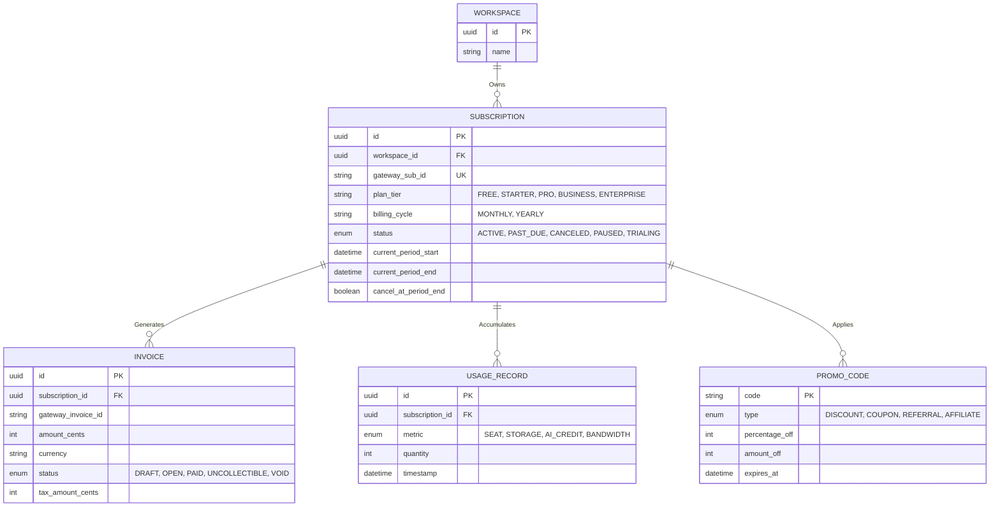
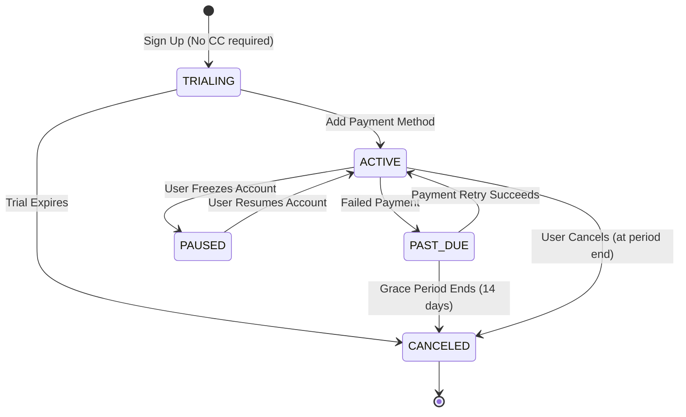
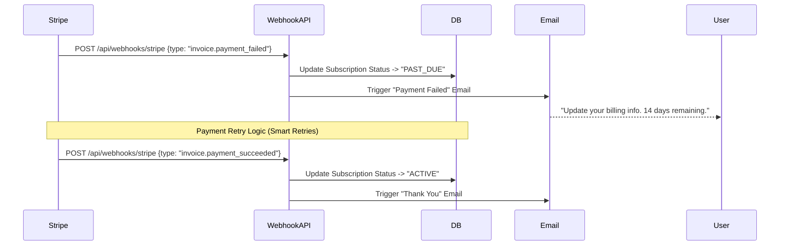

# Subscription & Billing System Specification

**Overview**: This document specifies the enterprise billing architecture, designed to handle complex B2B SaaS pricing models including flat-rate tiers, seat-based billing, and metered usage (AI credits, Bandwidth). It relies on robust webhook listeners to maintain synchronization with payment gateways (Stripe/Midtrans/Xendit).

---

## 1. Database & ERD

The billing system is deeply integrated into the Multi-Tenant `WORKSPACE` structure.

---

## 2. Subscription State Machine

The system manages subscriptions through a strict, deterministic state machine driven almost entirely by Gateway Webhooks.

---

## 3. Pricing Models & Workflows

### A. Flat-Rate Plans & Cycles
- **Tiers**: Free, Starter, Professional, Business, Enterprise.
- **Cycles**: Monthly or Yearly (with standard ~20% discount applied to Yearly).
- **Trial**: 14-day free trial on the Professional tier. Converts to Free Plan if no credit card is provided.

### B. Usage & Seat-Based Billing
- **Seat Based Billing**: Prorated automatically. If an Admin invites a new user mid-month, Stripe calculates the exact daily cost for the remaining days in the cycle.
- **Usage Based (Metered)**: Storage, Bandwidth, and AI Credits are reported hourly to Stripe via the `/v1/usage_records` API.
- **Workflow**: 
  1. User clicks "Generate AI Image".
  2. Next.js deducts 1 credit locally and fires an event to Redis.
  3. Redis aggregates usage. A CRON job reports total usage to the billing gateway every 24 hours to prevent API throttling.

### C. Promotions & Ecosystem
- **Coupons / Discounts**: Applied at checkout or mid-cycle. Supports percentage-off or flat-amount-off.
- **Referral / Affiliate**: Unique promo codes. When a new user signs up using a code, the system attributes the recurring revenue to the affiliate, generating a monthly payout report.

---

## 4. Upgrades, Downgrades & Refunds
- **Upgrade**: Immediate effect. The system calculates **Proration**, generating an immediate invoice for the price difference for the remainder of the month.
- **Downgrade**: Scheduled effect. The tier remains active until the `current_period_end`. At renewal, the new lower tier takes effect. Prevents complex negative-proration refunds.
- **Refund**: Handled purely via the Payment Gateway dashboard (e.g., Stripe) by support staff. Triggers an `invoice.refunded` webhook to update local DB records.

---

## 5. Webhooks & Notifications

The entire system is reactive to Webhooks to ensure total sync with the payment processor.

### A. Sequence Diagram: Failed Payment Workflow

### B. Grace Period & Retry Logic
- If a payment fails, the system enters a **Grace Period** (e.g., 14 days). The gateway utilizes "Smart Retries" (retrying on different days/times).
- If the final retry fails, the webhook `customer.subscription.deleted` fires, setting the workspace status to `CANCELED`.

---

## 6. APIs
- `POST /api/billing/checkout`: Creates a Stripe Checkout Session for a specific Plan/Cycle.
- `POST /api/billing/portal`: Generates a secure link to the Stripe Customer Portal for the user to update cards or download **Invoices** (including **Tax** breakdowns).
- `POST /api/billing/pause`: Switches subscription status to `PAUSED` (retains data but locks editing) at the end of the billing cycle.

---

## 7. Security & Edge Cases
- **Security**: Webhook endpoints are strictly validated using `Stripe-Signature` cryptographic verification to prevent malicious actors from sending fake `invoice.paid` events.
- **Security**: Tax compliance (VAT/Sales Tax) is offloaded entirely to Stripe Tax/TaxJar to prevent legal liabilities.
- **Edge Case (Multiple Webhooks)**: Webhooks can arrive out of order or be duplicated. 
  - *Mitigation*: The `WEBHOOK_LOG` table stores processed Event IDs. The API checks if `event_id` exists; if yes, it returns `200 OK` without processing, ensuring idempotency.
- **Edge Case (Simultaneous Upgrades)**: A user rapidly clicks "Upgrade" multiple times.
  - *Mitigation*: The database uses optimistic locking on the `SUBSCRIPTION` record. Stripe Checkout Sessions expire immediately upon first successful use.
