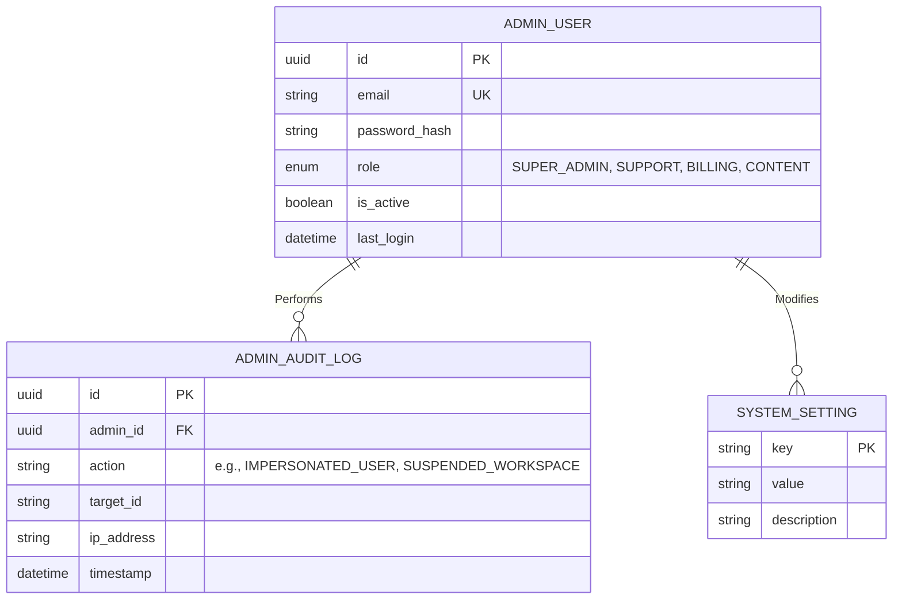

# Super Admin Panel Specification

**Overview**: The Super Admin Panel is an isolated, highly secure application (`admin.platform.com`) strictly reserved for internal platform staff. It manages global platform state, ecosystem marketplaces, customer support operations (impersonation), and high-level financial metrics.

---

## 1. Global Entity Relationship Diagram (ERD) & Database
The Super Admin panel interacts heavily with the core database, but also manages its own distinct internal `ADMIN_USER` table to prevent any overlap with customer authentication.

---

## 2. Dashboard Overview & Financials
**UI Flow**: The landing page upon authentication. A dense, high-contrast dashboard displaying real-time metrics.
- **Metrics Tracked**: Total Users, Active Users (Last 30 Days), Websites Created, Published Websites.
- **Financials**: Revenue (YTD), Monthly Recurring Revenue (MRR), Annual Recurring Revenue (ARR), Active Subscriptions, Failed Payments.
- **Visitor Statistics**: Aggregated global traffic handled by the CDN (queries ClickHouse directly).

## 3. User & Workspace Management
**UI Flow**: A data-grid (table) with advanced filtering (by Status, Plan, Join Date) and full-text search. Clicking a user opens a slide-out detailed drawer.
- **User Detail**: Shows associated Workspaces, active subscriptions, and billing history.
- **State Machine Actions**:
  - `Activate` / `Suspend` / `Delete`. Suspending a user immediately revokes all their active JWTs via Redis.
- **Login as User (Impersonation)**:
  - *Security Feature*: Generates a temporary, strictly audited JWT that allows the Admin to log in to the main SaaS (`app.platform.com`) as the customer. A prominent banner ("You are impersonating X") remains visible.
  - *API*: `POST /api/admin/users/{id}/impersonate`. Returns an impersonation token.
- **Reset Password**: Sends a secure password reset link directly to the user's email.

## 4. Ecosystem Management
- **Website Management**: View all sites. Admin can forcefully unpublish a site if it violates Terms of Service.
- **Template Management**: Curate the 50 default templates. Mark community templates as "Featured" or "Premium."
- **Category Management**: Define global industries and tags for templates and themes.
- **Theme Management**: Manage the global preset themes available to all users.

## 5. Billing & Commerce Management
- **Subscription Management**: Force-cancel subscriptions, manual upgrades (e.g., granting Enterprise access without a credit card).
- **Payment Management**: View Stripe/Midtrans webhooks. Resolve stuck or disputed payments manually.
- **Coupon Management**: Generate global or targeted promo codes (e.g., `BLACKFRIDAY50`).

## 6. Internal Content Management (CMS)
The platform's own marketing site (`www.platform.com`) is powered by this internal CMS.
- **Documentation CMS**: Manage help articles and developer API docs.
- **Blog CMS**: Manage company announcements and SEO articles.
- **FAQ CMS**: Manage the global Help Center.
- **Media Management**: Dedicated S3 bucket for platform marketing assets.

## 7. Communications & Settings
- **Contact Messages**: Inbox for forms submitted on the marketing site.
- **Notification Management**: Trigger global in-app toast notifications for all users (e.g., "Scheduled Maintenance at 12:00 UTC").
- **Announcement Banner**: Toggle a site-wide banner at the top of the SaaS builder.
- **System Settings**: Modify global feature flags (e.g., `ENABLE_AI_FEATURES = true`).

## 8. Security & Logging
- **Audit Log**: Every single action taken by any Admin is immutable and logged (who, what, when, IP).
- **Activity Log**: Global ledger of customer actions (e.g., thousands of "Published Site" events).

---

## 9. Roles & Permissions (Permission Matrix)
Strict internal RBAC enforcing the principle of least privilege.

| Feature Area | SUPER_ADMIN | SUPPORT | BILLING | CONTENT (Marketing) |
| :--- | :--- | :--- | :--- | :--- |
| **Impersonate User** | ✅ | ✅ | ❌ | ❌ |
| **Suspend User** | ✅ | ✅ | ❌ | ❌ |
| **View Revenue/MRR** | ✅ | ❌ | ✅ | ❌ |
| **Refund Payment** | ✅ | ❌ | ✅ | ❌ |
| **Edit System Settings** | ✅ | ❌ | ❌ | ❌ |
| **Publish Blog/Docs** | ✅ | ❌ | ❌ | ✅ |

---

## 10. REST API Standards (Admin Space)

### A. Authentication & Security
- **Domain Routing**: Admin APIs exist on a separate subdomain routing map (`/api/admin/v1/*`).
- **IP Allowlisting**: Access to the Admin API is restricted to Corporate VPN IPs or Zero Trust tunnels (e.g., Cloudflare Access).
- **MFA Enforcement**: All Admin users must have mandatory WebAuthn/2FA enabled.

### B. Example API: Impersonation
- **Method**: `POST /api/admin/v1/users/{userId}/impersonate`
- **Headers**: `Authorization: Bearer <admin_token>`
- **Response**: `200 OK { "impersonation_token": "eyJhb..." }`
- **Audit Action**: The database immediately logs an `IMPERSONATE_START` event tied to the Admin's UUID.
