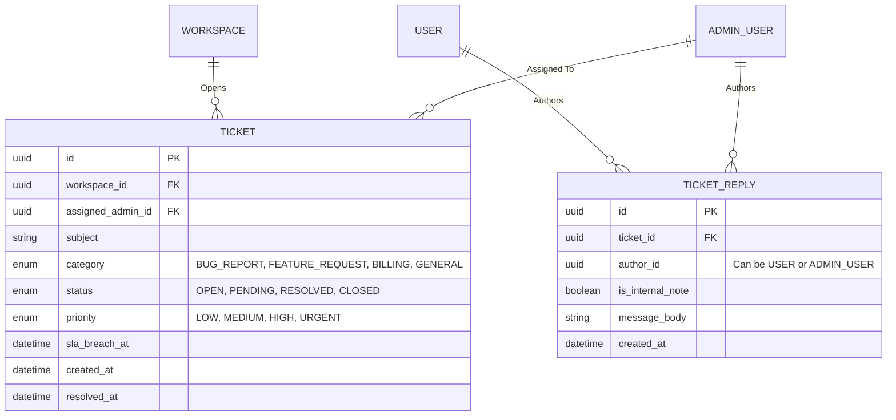

# Support Center Specification

**Overview**: The Support Center bridges the gap between end-users and the platform's internal Support Admins. It encompasses an integrated ticketing system, SLA tracking, and external Live Chat integrations (like Intercom/Zendesk) to provide enterprise-grade customer service natively within the Customer Dashboard.

---

## 1. Support Entity Relationship Diagram (ERD) & Database

The Support Center heavily utilizes the `ADMIN_USER` table (from the Super Admin Panel) for assignment and tracking.

---

## 2. Core Features & Workflows

**Supported Ticket Types**: Contact Form, Bug Report, Feature Request, General Support.
**Management Features**: Ticket Status, Priority, Assignment, Internal Notes, SLA.

### A. Ticket Submission Flow
1. **User Action**: A user in the Customer Dashboard clicks "Open Support Ticket".
2. **Categorization**: The UI requires them to select a Category (e.g., `BUG_REPORT` or `FEATURE_REQUEST`).
3. **Database Insertion**: The API creates a `TICKET`. If the user's Workspace is on the `ENTERPRISE` billing tier, the API automatically elevates the `priority` to `URGENT`.
4. **SLA Calculation**: Based on the priority (e.g., `URGENT`), the system sets `sla_breach_at` to exactly 1 hour from submission.
5. **Notification**: A webhook fires to the Super Admin Slack channel or Zendesk inbox: "New Urgent Ticket from Enterprise Client."

### B. Admin Resolution Flow
1. **Assignment**: A Support Admin logs into the Super Admin Panel and claims the ticket (`assigned_admin_id = current_admin_id`).
2. **Internal Collaboration**: The Admin writes a reply but toggles `is_internal_note = true`. This saves to `TICKET_REPLY` but completely hides the message from the customer's UI, allowing admins to discuss fixes privately.
3. **Status Updates**: The Admin replies to the customer and changes the status to `PENDING` (waiting on customer response).
4. **Resolution**: Once fixed, the Admin marks the ticket `RESOLVED`. The system records `resolved_at` and automatically calculates the total time-to-resolution for performance reporting.

---

## 3. Integrations & External Assets

**Supported**: Live Chat Integration, Knowledge Base, FAQ.

### A. Live Chat Integration (Workflow)
- Instead of building a massive real-time chat engine from scratch, the platform integrates with Intercom/Crisp.
- When a user logs into the Customer Dashboard, the Next.js frontend injects an Intercom boot script.
- **Security**: The script passes an HMAC hash generated server-side using the `user_id` and an Intercom Secret. This guarantees that a malicious actor cannot impersonate a user in Live Chat.

### B. Knowledge Base & FAQ
- As defined in the `DOCS_WEBSITE_SPEC.md`, the platform hosts a public FAQ and Knowledge Base.
- **Support Deflection**: Before a user can submit a ticket in the Contact Form, the UI forces them to type a subject. The UI debounces this input and searches the Knowledge Base via Algolia. It dynamically suggests 3 articles (e.g., "How to fix DNS issues") to deflect the ticket and provide immediate answers.

---

## 4. API & Dashboard Layouts

### A. Dashboard Layout (Customer Side)
- Located in the Customer Dashboard under **Support**.
- A simple, clean data-grid displaying previous tickets, colored badges for `status` (Open, Resolved), and the `subject`.
- Clicking a ticket opens a chat-like interface displaying all non-internal `TICKET_REPLY` records.

### B. Dashboard Layout (Super Admin Side)
- A highly dense, operational triage view.
- Sorted by default by `sla_breach_at ASC` (tickets closest to breaching their Service Level Agreement appear at the very top).
- Quick-filters for "Unassigned" and "High Priority".

### C. API Endpoints
- `POST /api/v1/workspaces/{id}/tickets`: Submits a new ticket.
- `GET /api/v1/workspaces/{id}/tickets/{ticketId}/replies`: Fetches the conversation thread (automatically filtering out `is_internal_note=true` for standard users).
- `POST /api/v1/admin/tickets/{ticketId}/reply`: For Support Admins to post responses or internal notes.
