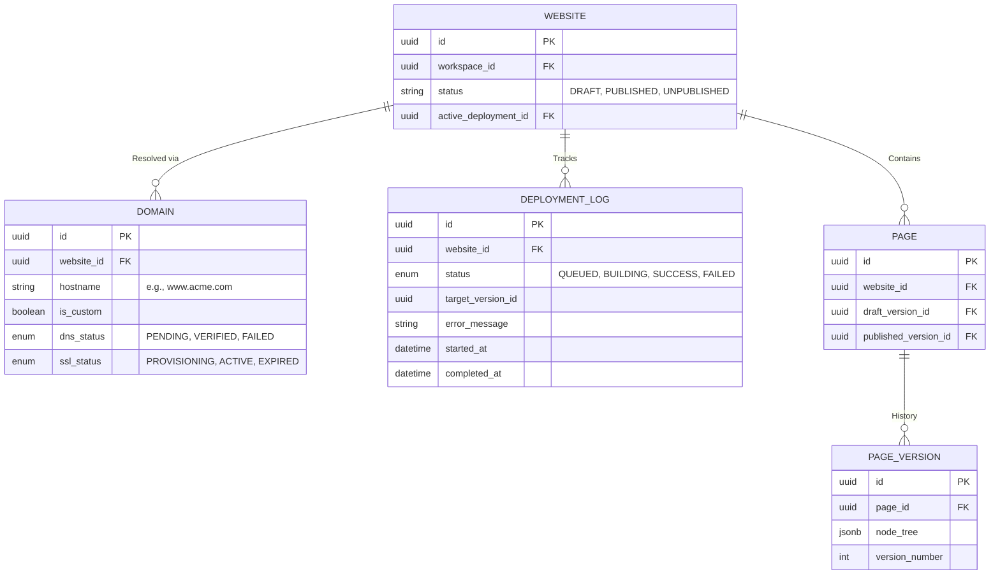

# Website Publishing & Deployment Specification

**Overview**: This document details the absolute lifecycle of a website from Draft to Production. It governs domain routing, SSL provisioning, and the highly reliable background queuing architecture required to execute zero-downtime deployments and instant rollbacks.

---

## 1. Publishing Entity Relationship Diagram (ERD) & Database

The publishing pipeline strictly isolates the Draft state from the Published state using immutable `PAGE_VERSION` pointers.

---

## 2. Core Publishing Pipeline & Workflows

**Supported Actions**: Preview, Draft, Publish, Republish, Unpublish, Rollback, Cache Clear.

### A. The Publishing Pipeline (Step-by-Step)
1. **Trigger**: User clicks "Publish". The API handles this synchronously, returning a `202 Accepted` and immediately inserting a record into `DEPLOYMENT_LOG` with status `QUEUED`.
2. **Publishing Queue**: A Redis-backed background worker pulls the job. Status changes to `BUILDING`.
3. **Snapshotting (Version History)**: The worker deep-clones the JSON trees of all `PAGE`s currently pointed to by `draft_version_id` and assigns them to `published_version_id`.
4. **Compilation**: The worker executes the Next.js SSG build step or triggers Incremental Static Regeneration (ISR) logic.
5. **Cache Clear**: The worker calls the Edge CDN (Cloudflare/Vercel) API to execute a precise Cache Purge for the affected website ID.
6. **Completion**: `DEPLOYMENT_LOG` status becomes `SUCCESS`. WebSockets notify the UI to update the **Publishing Status** to "Live".

### B. Republish & Unpublish
- **Republish**: Re-triggers the exact pipeline above to push new Draft changes to live.
- **Unpublish**: Sets `WEBSITE.status = UNPUBLISHED`. Instantly executes a global Cache Purge. The Next.js Edge Middleware begins intercepting requests to the domain and returning a `404 Not Found` or custom "Under Construction" page.

### C. Rollback & Publish History
- **Publish History**: The UI reads the `DEPLOYMENT_LOG` (e.g., "Deployed Today at 4 PM by Admin").
- **Rollback**: User clicks "Revert" on an old deployment log. The worker simply repoints all `PAGE.published_version_id` references to the older `PAGE_VERSION` UUIDs and triggers an instant Cache Clear. Rollback takes <2 seconds as no JSON needs to be rebuilt.

---

## 3. Domain & DNS Architecture

**Supported**: Custom Domain, Subdomain, SSL, DNS Verification.

### A. Subdomain & Custom Domain Workflow
1. **Subdomain**: A free domain (`[uuid].platform.com`) is mapped instantly upon website creation via Wildcard DNS.
2. **Custom Domain**: User enters `www.client.com`. The system generates a unique TXT record for **DNS Verification**.
3. The background worker polls the DNS registrar every 5 minutes. Once the TXT or CNAME record propagates, `DOMAIN.dns_status` becomes `VERIFIED`.

### B. SSL Provisioning API
- Once DNS is verified, the system triggers the Let's Encrypt / Vercel API to provision a TLS certificate. `DOMAIN.ssl_status` becomes `ACTIVE`, enabling HTTPS.

---

## 4. API Endpoints
- `POST /api/v1/websites/{id}/publish`: Triggers the Publishing Queue.
- `POST /api/v1/websites/{id}/unpublish`: Pulls the site offline.
- `POST /api/v1/websites/{id}/rollback`: Expects `{ "deploymentId": "xyz" }` in the body.
- `POST /api/v1/websites/{id}/domains`: Attaches a new Custom Domain.

---

## 5. Error Handling & Recovery

- **Pipeline Failures**: If the background worker encounters an exception (e.g., invalid JSON syntax during SSG compilation), it catches the error.
- **State Resolution**: `DEPLOYMENT_LOG` is marked `FAILED`. The exact stack trace is written to `error_message`.
- **Fail-Safe Mechanism**: The `PAGE.published_version_id` is NEVER updated until the very final step of the pipeline. If a build fails, the active Edge Cache is NEVER purged. **Result: A failed deployment has zero impact on the live production website.** The user is simply notified to check the Deployment Log.
